# ❤️Awesome Flutter ❤️ tips and tricks ❤️

## #Day1 `stless` & `stful`.

We can type `stless` and `stful` and we get Autocomplete Suggestion to generate Stateless Flutter Widget or Stateful Flutter Widget Respectively.

## #Day2 `If Null` Operator (`??`).

`??` checks If something is `null`. If it's not null it returns its own value but if it's `null` it returns the value after `??`

`return abc??10; //returns 10 if abc is null else returns its own value,`

It also has shorthand assignment when it's null.

`abc??=5 //assigns 5 to abc if it's null`

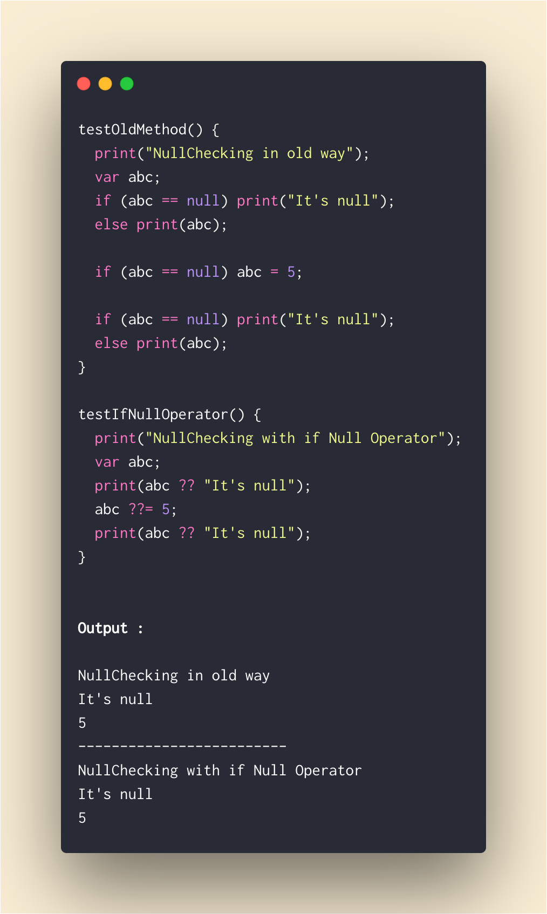

## #Day3 Inner Function.

We can define a function inside another function.

This is to encapsulate the inner function from everything else outside the outer function.

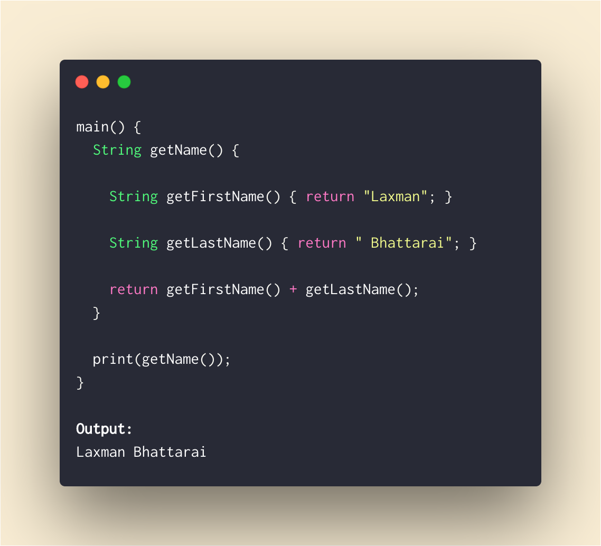

## #Day4 ..Cascade..Chaining..Fluent API

We can chain method/member calls without returning `this` from **method(), getter() and setter()** using cascade operator (..)

try in [Dartpad](https://dartpad.dartlang.org/290e17306b745ed83b9242653ca55041)

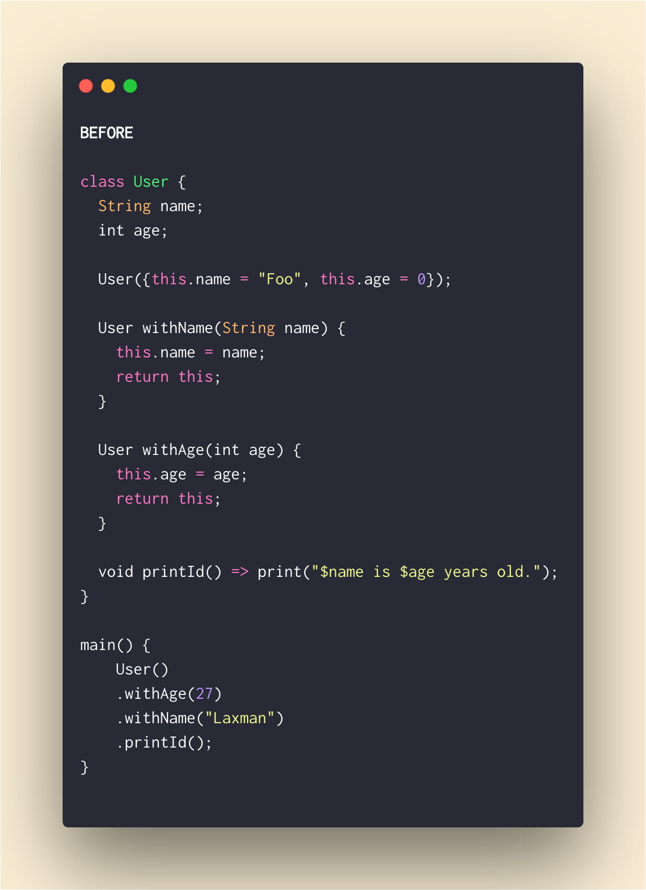

Can be replaced with

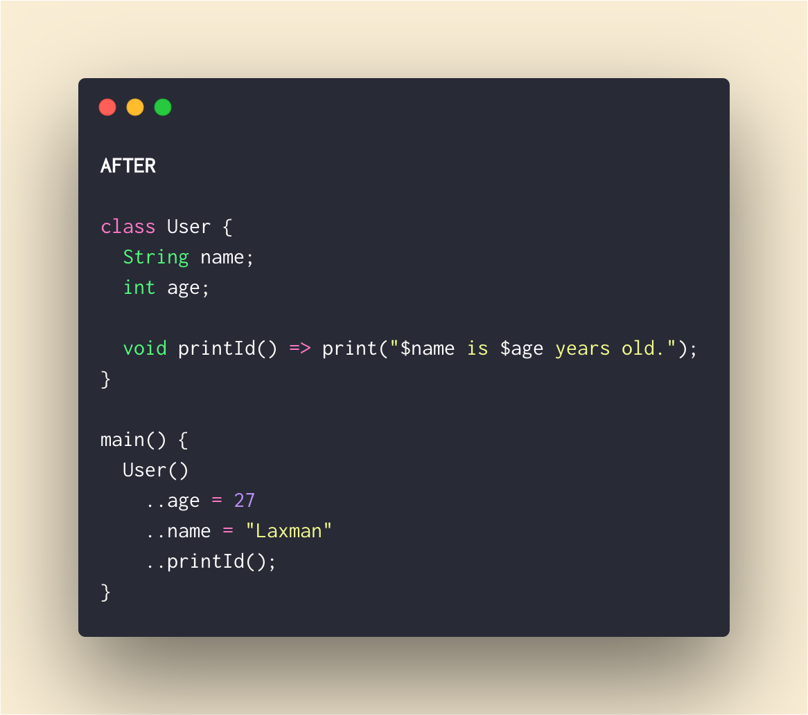

## #Day5 Dart `data class`

Dart does not support data class by default, but with plugins, we can simply generate data class (`copyWith()`,`fromMap()`, `toMap()`, `Named Constructor`, `toString()`,`hashCode()` & `equals()` methods implemented by the tool).

### `🚨❗️Caution❗️🚨` : **Your cursor should be inside the class that you want to generate data class.**

Download Plugins :

[For Android Studio](https://plugins.jetbrains.com/plugin/12429-dart-data-class)

[For VsCode](https://marketplace.visualstudio.com/items?itemName=BendixMa.dart-data-class-generator)

## #Day6 RichText Widget

If you want to have a single text with different style within it? Do not bother or try to hack with with `Text()` and use `RichText()` with `TextSpan()`

[Try on dartpad](https://dartpad.dartlang.org/f87dddb2f48f1d1ef0f25903af1ded58)

[See Youtube Demo](https://www.youtube.com/watch?v=rykDVh-QFfw)

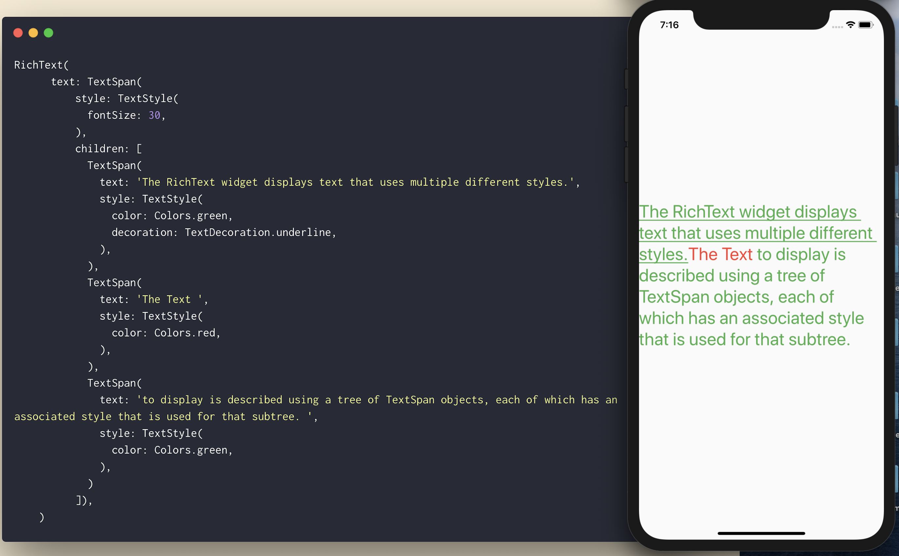

## #Day7 Spacer Widget

Using Container with certain height/width to create responsive space between Widgets? That may look good on one screen but will not look the same in different screen size.

Spacer Widget comes for the rescue. Instead of `Container(width: / height: )`, use `Spacer(flex: )`.

How on this earth did I not know about this widget earlier? This is going to save many lives 😂

[Try on dartpad](https://dartpad.dev/f0d077124527a8078cdb2eede1e9bf73)

[See Youtube Demo](https://www.youtube.com/watch?v=7FJgd7QN1zI)

## #Day8

If you have you been adding `Container()` with `maxwidth` at the bottom of `ListItem` to put divider line like me, you have been doing it wrong all the time.

Flutter has `ListView.separated` just for that purpose. We have to also provide `separatorBuilder` in addition to what we already passed while using `ListView.builder`

**Bonus 🍾🎁🎊🎉 : You do not have to check if the item is last in order not to draw divider after the last item.**

[try in dartpad](https://dartpad.dartlang.org/31ec967b140ac6a5795c38ea4bdfd9a2)

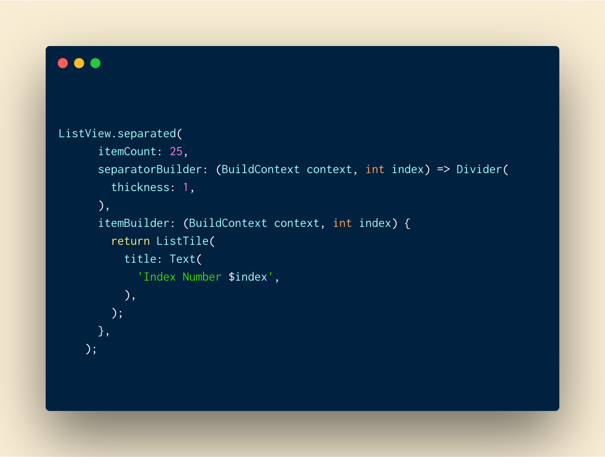

## #Day9 Passing Function as parameter

We can simply pass a `function` as `parameter` like we pass a variable. When we want to call the passed function from calling function, we just call it with `()` at the end along with parameters if it accepts any.

[try in dartpad](https://dartpad.dev/fa46336f5c1b3287c6420d3b3a277178)

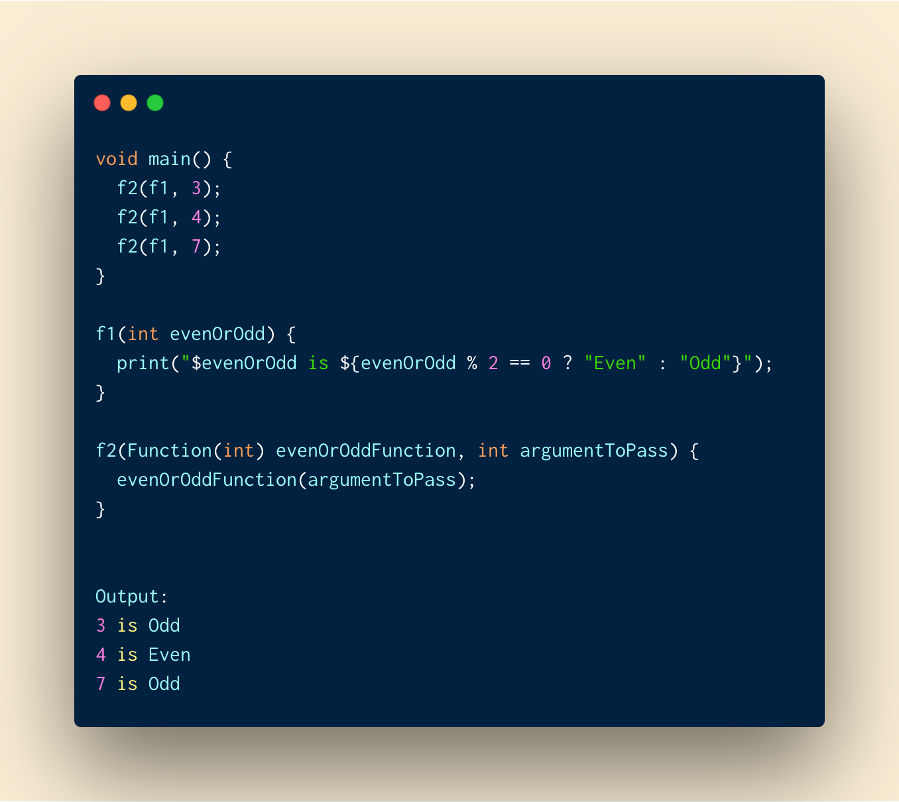

---

## #Day10 Relative Import : the right way to import `.dart` files we have in our lib package.

Ever wondered what is the right way to import a file in your own package?

Prefer relative imports to absolute imports.

Why?

- It's shorter and cleaner.
- We can easily differentiate our files and third-party ones.
- It makes sense, doesn't it?

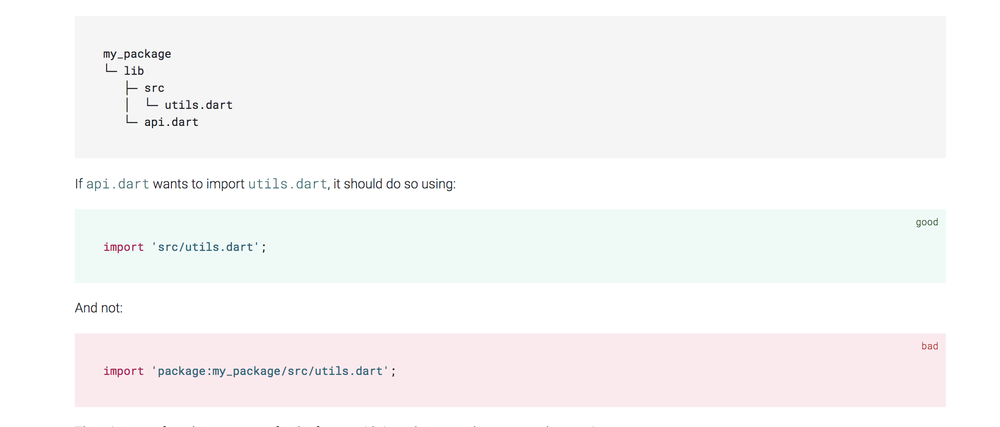

## #Day11 Reusing Text Style

Tired of defining `textStyle` everytime you want to customize `Text`? **Even worse** if you have multiple theme (**dark, light, full black theme etc**).

just use

`Theme.of(context).textTheme.title`

where there are other styles like `title` inside `textTheme`.

[try in dartpad with theme example](https://dartpad.dartlang.org/5270714ce97853fc36db1b17c255c999)

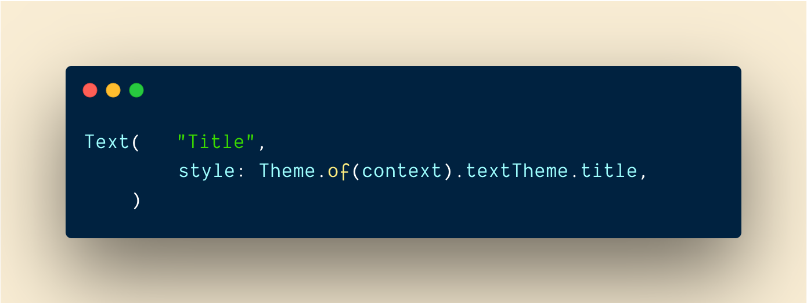

## #Day12 Use Literal to initialize growable collections.

If we are to initialize growable collection, use literal initialization rather than with constructors.

    // Good
    var points = [];
    var addresses = {};

    // Bad
    var points = List();
    var addresses = Map();

    // With type argument

    // Good
    var points = <Point>[];
    var addresses = <String, Address>{};

    // Bad
    var points = List<Point>();
    var addresses = Map<String, Address>();

## #Day13 Fat arrow functions

We can use fat arrow `=>` members (`function, getter,setter`) in dart.

I would not use `=>` if the declaration is not **ONE LINER**. But few lines are OK.

[try on dartpad](https://dartpad.dev/76922028eccb4535f0cdddc8e4b17aa1)

    void main() {
    User()
        ..firstName = "Laxman"
        ..lastName = " Bhattarai"
        ..age = 18
        ..printUser();
    }

    class User {
    String firstName;
    String lastName;
    DateTime birthday;

    String get fullName => firstName + lastName;

    set age(int age) =>  birthday = DateTime.now().subtract(Duration(days: age * 365));

    int get age => DateTime.now().year - birthday.year;

    bool get isAdult => age >= 18;

    printUser() => print(fullName + " is a ${isAdult ? "Adult" : "Child"}");
    }

## #Day14 FractionallySizedBox

Ever wanted the widget to have height and width exactly in the same proportion to it's screen's height and width?

FractionallySizedBox is build exactly for that use case. Just give it the fraction you need for your height and width and it will handle everything else. The fraction value will range between 0.0 to 1.0

    FractionallySizedBox(
                widthFactor: 0.5,
                heightFactor: 0.5,
                child: Container(color: Colors.green),
            )

[try on codepen](https://codepen.io/erluxman/pen/rNOLOzG)

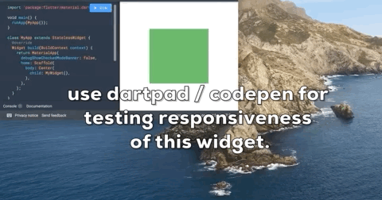

## #Day15 Flexible vs Expanded

Expanded() is nothing more than Flexible() with

    Flexible (fit: FlexFit.tight) = Expanded()

but, Flexible uses `fit :FlexFit.loose` by default.

**FlexFit.tight** = Wants to fit tight into parent taking as much space as possible.

**FlexFit.loose** = Wants to fit loose into parent taking as little space as possible for itself.

**flex** = The factor of space taken from parent. Mostly not fully used if `flex: FlexFit.loose` used i.e. `Flexible`.

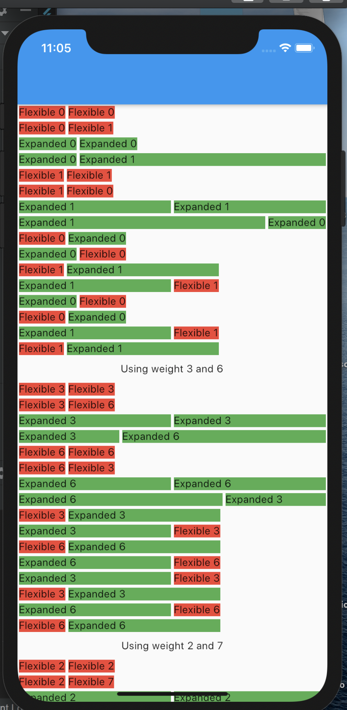

If you fully read the following image, you will fully understand the difference between `Flexible` and `Expanded`
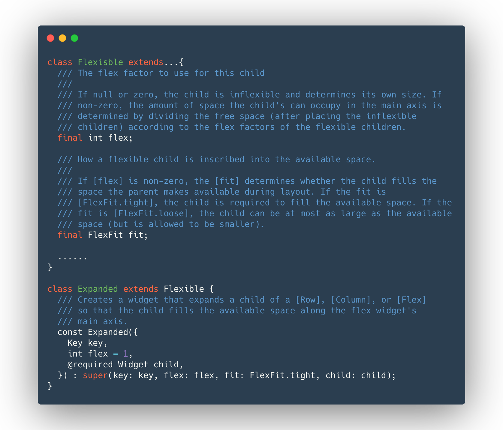

[try in codepen](https://codepen.io/erluxman/pen/JjYKZGG)

## #Day16 Bulk declaration

If you have been declaring each member separately all the time, you can declare members of same types at once.

I wouldn't declare `age` and `shoeSize` at once because they are not related.

With great power comes great responsibility, Use this wisely.
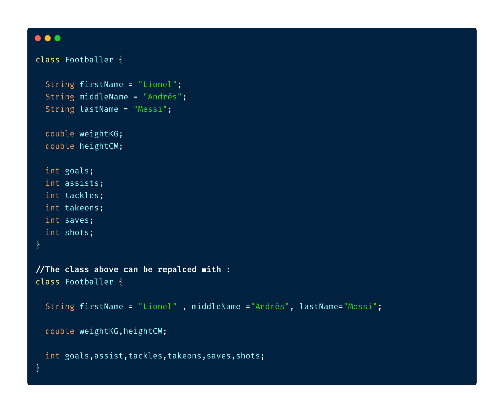

## #Day17 SliverAppBar / Collapsable AppBar / ParallaxHeader

Remember CollapsableAppBar (android) / ParallaxHeader (ios)? We have SliverAppBar in Flutter to do exactly that.

To use it, you will have to have a CustomScrollView as parent.

then you add two slivers of it.

1. SliverAppBar
2. SliverFillRemaining

You can play with values of snap, floating, pinned etc to get desired effect

[try on dartpad](https://dartpad.dartlang.org/6874032a7a1ea129640b8f617f7ffed3)

[see various types of SliverAppBars here ](https://api.flutter.dev/flutter/material/SliverAppBar-class.html#snippet-container)

## #Day18 What the Key?

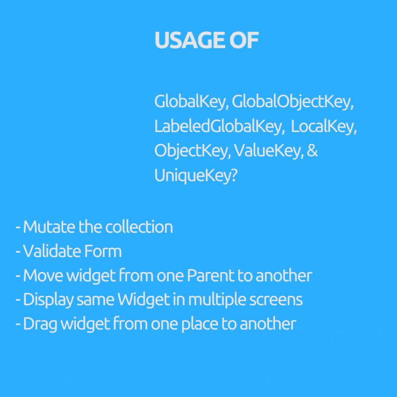

Ever wondered why we need GlobalKey(children : GlobalObjectKey, LabeledGlobalKey), LocalKey(children: ObjectKey, ValueKey & UniqueKey) right?

They are used to access or restore state In a statefulWidget (Mostly we don't need them at all if our widget tree is all Stateless Widgets).

### Purpose (Key to use inside bracket) :

- Mutate the collection i.e. remove / add / reorder item to list in stateful widget like draggable todo list where checked items get removed (ObjectKey, ValueKey & UniqueKey)
- Move widget from one Parent to another preserving it's state. (GlobalKey)
- Display same Widget in multiple screens and holding its state.(GlobalKey)
- Validate Form.(GlobalKey)
- You can to give a key without using any data. (UniqueKey)
- If you can use certain field of data like UUID of users as unique Key. (ValueKey)
- If you do not have any unique field to use as key but object itself is unique. (ObjectKey)
- If you have multiple Forms or Multiple Widgets of same type that need GlobalKey. (GlobalObjectKey, LabeledGlobalKey whichever is appropriate , similar logic to ValueKey and ObjectKey)

[Learn more on this video](https://www.youtube.com/watch?v=kn0EOS-ZiIc)

## #Day19 Amazing Library Time.dart

If you are tired to long and verbose DateTime and Duration calculation `Time.dart` comes to your rescue.

    //Before
    var 3dayLater = DateTime.now().add(Duration(days: 3)).day;

    //After
    var 3dayLater = 3.days.fromNow.day;

    //Before
    var duration = Duration(minutes: 10) +Duration(seconds: 15) -
        Duration(minutes: 3) +Duration(hours: 2);

    //After
    var duration = 10.minutes + 15.seconds - 3.minutes + 2.hours;

    //Before
    await  Future.delayed(Duration(seconds: 2))

    //After
    await 2.seconds.delay

give it a try https://github.com/jogboms/time.dart

## #Day20 Testing errors

You can simply test if two values are equal in dart with `expect(actual, expected)`

But if you want to test errors use the `function closure` that throws error as actual and check with `throwsA<ErrorType>` as expected.

      void main() {
        group("Exception/Error testing", () {
          test("test method that throws errors", () {
            expect(_testError(fails: false), false);
            expect(() => _testError(fails: true), throwsA(isA<FooError>()));
          });
        });
      }

      bool _testError({bool fails}) {
        if(fails)throw FooError();
        return fails;
      }

      class FooError extends Error {}

## #Day21 Concisely add collection into collection with `Spread(...)` operator

We normally use addAll() on collection to add one collection to another.

But From dart 2.3 and above, we can use Spread Operator (`...`) to add collection inside collection.

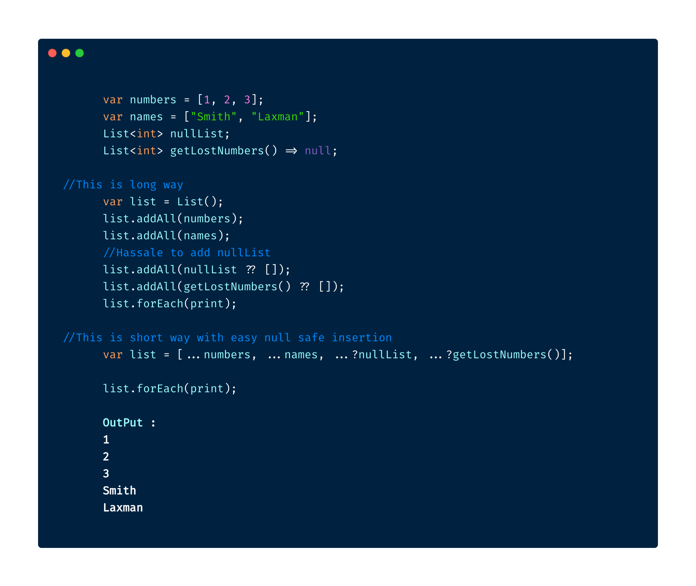

[try in dartpad](https://dartpad.dev/98c2ab9d41fb2c20cc67c94956972721)

## #Day22 Callable Class

In flutter we can call instance of a class like we call method. 

What you have to do is defile a `call()` method of any return type or arguments. that `call()` method will be called when you call the instance.

    void main() {
        var member = CallableClass();
        member("Flutter");
    }

    class CallableClass{
        call(String name){
            print("Name is $name");
        }
    }

[try in dartpad](https://dartpad.dartlang.org/294c4973aeab2b8312e415ce4dc55799)

## #Day23 ListWheelScrollView

We can implement following Wheel List using `ListWheelScrollView` in flutter.

Just give it the children and it will start working for you.

You can customize the wheel with Constructor arguments of `ListWheelScrollView` play with them.

    ListWheelScrollView(
        children: <Widget>[
            ..Children Widgets
        ],
    )

[try on dartpad](https://dartpad.dartlang.org/a30529134eb181507207f305b2bf6201)

[try on codepen](https://codepen.io/erluxman/pen/NWGjBjX)

## #Day24 Rectangular Fab with Notched Bottom Appbar.

Circular notched Button Bar with Fab is cool

**BUT**

Ever wanted rectangular Fab with Notch?

`FloatingActionButton.extended` with `BottomAppBar`'s `shape` as `AutomaticNotchedShape` like this:

    shape: AutomaticNotchedShape(
            RoundedRectangleBorder(),
            StadiumBorder(
              side: BorderSide(),
            ),
          ),

[try this code on your editor](https://gist.github.com/erluxman/fd442639bcaf84e14b31f70b00c48fe9)

## #Day25 Google Fonts in flutter

With the pub.dev package `google_fonts` you can use any google fonts without downloading them.

Just give the textStyle as any google fonts.

Want to set other textStyles properties? Just provide `textStyle` to the font (Which is a textStyle itself)

    Text(
        'Notched Rectangular Fab',
        style: GoogleFonts.pacifico(
            textStyle: TextStyle(color: Colors.red),
        ),)

[try on pub.dev](https://pub.dev/packages/google_fonts)

## #Day26 Hero Animation (Shared Element Transition)

### **Do you want your Widget/Image to fly from one screen to another?**

Flutter makes it super easy to do **Shared Element / Hero animation** with Widget called `Hero`.
Just give **same `tag`** for the `Hero` widget in both screen and your Widget will start flying from one screen to another.

Caution : Do not give a static string as tag if your UI has dynamic data like List, use a value of object like title,id etc as tag

    //First Screen

    FirstPageWidget extends StatelessWidget{
    return Scaffold(
        ...
        Hero(
            tag: player.name
            child: Image.network(url)
        )
        //Other player List
        ...
        );
    }

    //Second Page

    SecondPageWidget extends StatelessWidget{
    return Scaffold(
        ...
        Hero(
            tag: player.name
            child: Image.network(url)
            )
        //Player details
        ...
        );
    }

[try on Codepen](https://codepen.io/erluxman/pen/eYpEjoQ)

For better experience : Decrease the browser width

## #Day27 Dart function/constructor Arguments

There are three types of arguments (Function arguments and constructor arguments work the same way).

1. Normal Parameters (✅✅Short & ❌Flexible) => required, requires all arguments to be called in order, most concise (doesn't need argument names),least flexible.

2. Named Parameters (✅Short & ✅✅Flexible) => Optional, can be called in any order BUT must provide the argument name.

3. Positional Parameters (✅✅Short & ✅Flexible) => optional but we cannot skip any argument on left to provide argument right to it. Does not require argument name.

        void main() {
            normalFunction("Laxman", "Bhattarai", 26, 65);

            optionalFunction("Laxman", "Bhattarai");
            optionalFunction("Laxman", "Bhattarai", age: 26);
            optionalFunction("Laxman", "Bhattarai", weight: 65);
            optionalFunction("Laxman", "Bhattarai", weight: 65, age: 26);

            positionalFunction("Laxman", "Bhattarai");
            positionalFunction("Laxman", "Bhattarai", 26);
            positionalFunction("Laxman", "Bhattarai", 26, 65);
        }

        //Requires all arguments passed in order, i.e. no meaning of default parameters
        normalFunction(String firstName, String lastName, int age, int weight) {
            print("$firstName $lastName age: $age weight: $weight");
        }

        //Optional, can be called in any order BUT must provide the argument name.
        optionalFunction(String firstName, String lastName,
            {int age = 18, int weight = 60}) {
            print("$firstName $lastName age: $age weight: $weight");
        }

        //Optional, doesn't need argument name  but cannot be skipped an argument on left to provide argument on right of it.
        positionalFunction(String first, String last,[int age = 18, int weight = 60]) {
            print("$first $last age: $age weight: $weight");
        }

[try on dartpad](https://dartpad.dartlang.org/5cb4bf8b064f117a22aadaee26747721)

## #Day28 AnimatedContainer

`ImplicitlyAnimatedWidget`s like `AnimatedAlign,AnimatedContainer, AnimatedPadding, AnimatedTheme` are easy way to do animation.

`AnimatedContainer()` is one of the most common.

You can animate any properties of `container` with `AnimatedContainer`. Mastery of this widget alone can get you far ahead in you animation game.

Just provide the changed value like

    height, width,padding,transform,decoration(backgroundcolor, border radius & alignment etc.

along with curve then AnimatedContainer will automatically do the animation for you.

The following animation is done with just `AnimatedContainer()`

[play with the animation in codepen](https://codepen.io/erluxman/pen/MWaEZEz)

