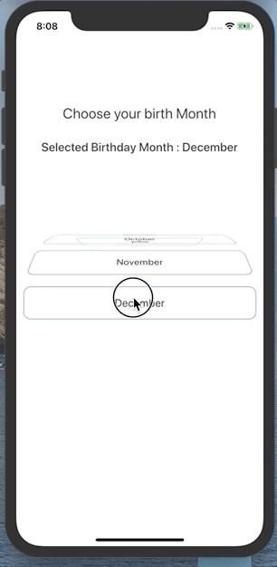
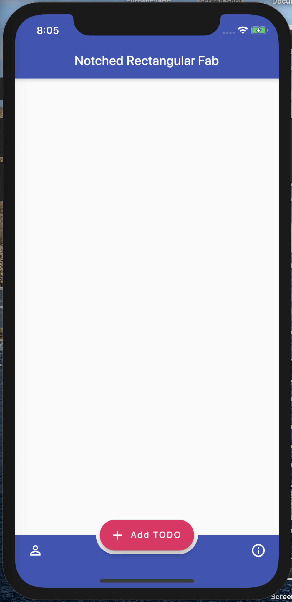
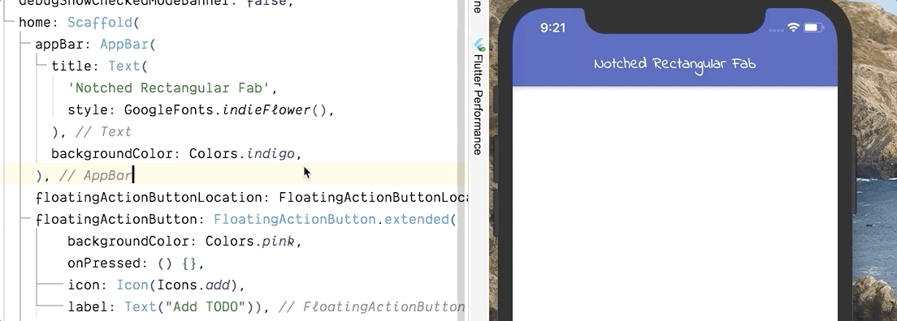
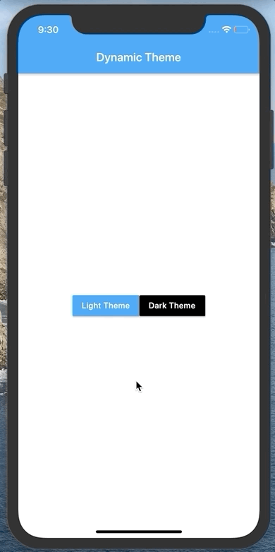
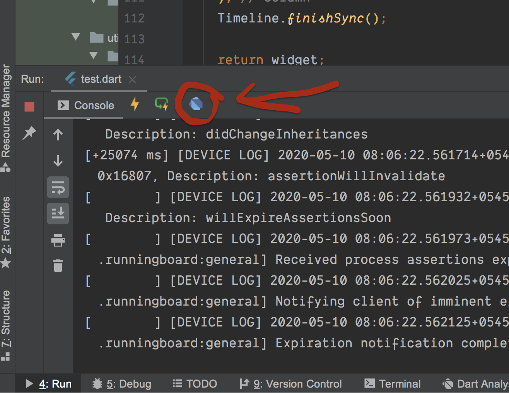
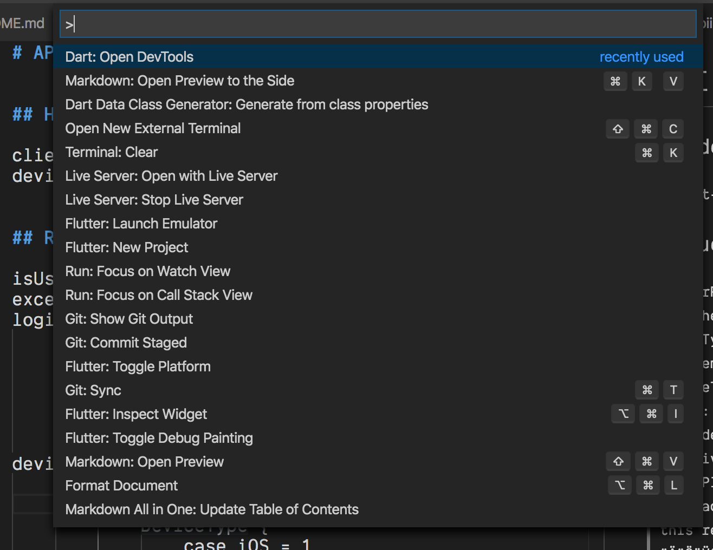
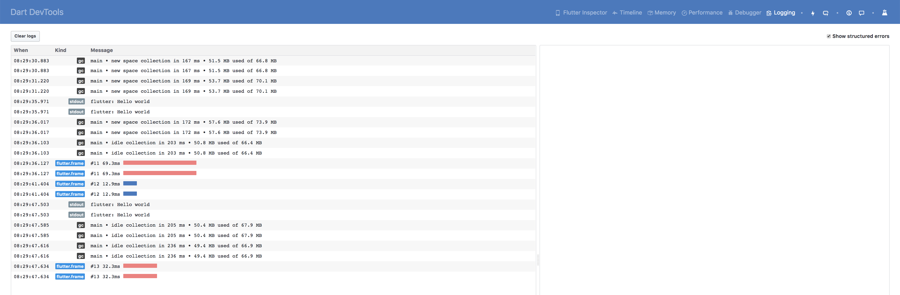

# Tips 21-40

## Tip 21 : Concisely add collection into collection with `Spread(...)` operator

We normally use addAll() on collection to add one collection to another.

But From dart 2.3 and above, we can use Spread Operator (`...`) to add collection inside collection.

```dart
var numbers = [1, 2, 3];
var names = ["Smith", "Laxman"];
List<int> nullList;
List<int> getLostNumbers() => null;

// This is long way
var list = List();
list.addAll(numbers);
list.addAll(names);

// Hassale to add nullList
list.addAll(nullList ?? []);
list.addAll(getLostNumbers() ?? []);
list.forEach(print);

// This is short way with easy null safe insertion
var list = [...numbers, ...names, ...?nullList, ...?getLostNumbers()];

list.forEach(print);
```
Output:

```
1
2
3
Smith
Laxman
```

[try in dartpad](https://dartpad.dev/98c2ab9d41fb2c20cc67c94956972721)


## Tip 22 : Callable Class

In flutter we can call instance of a class like we call method.

What you have to do is defile a `call()` method of any return type or arguments. that `call()` method will be called when you call the instance.

```dart
void main() {
    var member = CallableClass();
    member("Flutter");    
}

class CallableClass{
    call(String name){
        print("Name is $name");
    }
}
```

[try in dartpad](https://dartpad.dartlang.org/294c4973aeab2b8312e415ce4dc55799)

## Tip 23 : ListWheelScrollView

We can implement following Wheel List using `ListWheelScrollView` in flutter.

Just give it the children and it will start working for you.

You can customize the wheel with Constructor arguments of `ListWheelScrollView` play with them.

```
ListWheelScrollView(
    children: <Widget>[
        ..Children Widgets
    ],
)
```

[try on dartpad](https://dartpad.dartlang.org/a30529134eb181507207f305b2bf6201)

[try on codepen](https://codepen.io/erluxman/pen/NWGjBjX)



## Tip 24 : Rectangular Fab with Notched Bottom Appbar

Circular notched Button Bar with Fab is cool

### ___**BUT**___

Ever wanted rectangular/stadium Fab with Notch?

`FloatingActionButton.extended` with `BottomAppBar`'s `shape` as `AutomaticNotchedShape` like this:

```
shape: AutomaticNotchedShape(
            RoundedRectangleBorder(),
            StadiumBorder(
              side: BorderSide(),
            ),
        ),
```
    

[try this code on your editor](https://gist.github.com/erluxman/fd442639bcaf84e14b31f70b00c48fe9)

[](assets/24rectangularnotch.png)

## Tip 25 : Google Fonts in flutter

With the pub.dev package `google_fonts` you can use any google fonts without downloading them.

Just give the textStyle as any google fonts.

Want to set other textStyles properties? Just provide `textStyle` to the font (Which is a textStyle itself)

```
Text(
    'Notched Rectangular Fab',
    style: GoogleFonts.pacifico(
        textStyle: TextStyle(color: Colors.red),
    ),
)
```

[try on pub.dev](https://pub.dev/packages/google_fonts)



## Tip 26 : Hero Animation (Shared Element Transition)

### **Do you want your Widget/Image to fly from one screen to another?**

Flutter makes it super easy to do **Shared Element / Hero animation** with Widget called `Hero`.
Just give **same `tag`** for the `Hero` widget in both screen and your Widget will start flying from one screen to another.

Caution : Do not give a static string as tag if your UI has dynamic data like List, use a value of object like title,id etc as tag

```dart
//First Screen

FirstPageWidget extends StatelessWidget{
    return Scaffold(
        ...
        Hero(
            tag: player.name
            child: Image.network(url)
        )
        //Other player List
        ...
        );
}

//Second Page

SecondPageWidget extends StatelessWidget{
    return Scaffold(
        ...
        Hero(
            tag: player.name
            child: Image.network(url)
            )
        //Player details
        ...
        );
}
```
    

[try on Codepen](https://codepen.io/erluxman/pen/eYpEjoQ)

For better experience : Decrease the browser width


## Tip 27 : Dart function/constructor Arguments

There are three types of arguments (Function arguments and constructor arguments work the same way).

1. Normal Parameters (✅✅Short & ❌Flexible) => required, requires all arguments to be called in order, most concise (doesn't need argument names),least flexible.

2. Named Parameters (✅Short & ✅✅Flexible) => Optional, can be called in any order BUT must provide the argument name.

3. Positional Parameters (✅✅Short & ✅Flexible) => optional but we cannot skip any argument on left to provide argument right to it. Does not require argument name.

```dart
void main() {
    normalFunction("Laxman", "Bhattarai", 26, 65);

    optionalFunction("Laxman", "Bhattarai");
    optionalFunction("Laxman", "Bhattarai", age: 26);
    optionalFunction("Laxman", "Bhattarai", weight: 65);
    optionalFunction("Laxman", "Bhattarai", weight: 65, age: 26);

    positionalFunction("Laxman", "Bhattarai");
    positionalFunction("Laxman", "Bhattarai", 26);
    positionalFunction("Laxman", "Bhattarai", 26, 65);
}


//Requires all arguments passed in order, i.e. no meaning of default parameters
normalFunction(String firstName, String lastName, int age, int weight) {
    print("$firstName $lastName age: $age weight: $weight");
}


//Optional, can be called in any order BUT must provide the argument name.
optionalFunction(String firstName, String lastName,
    {int age = 18, int weight = 60}) {
    print("$firstName $lastName age: $age weight: $weight");
}

//Optional, doesn't need argument name  but cannot be skipped an argument on left to provide argument on right of it.
    positionalFunction(String first, String last,[int age = 18, int weight = 60]) {
        print("$first $last age: $age weight: $weight");
}
```


[try on dartpad](https://dartpad.dartlang.org/5cb4bf8b064f117a22aadaee26747721)

## Tip 28 : AnimatedContainer

`ImplicitlyAnimatedWidget`s like `AnimatedAlign,AnimatedContainer, AnimatedPadding, AnimatedTheme` are easy way to do animation.

`AnimatedContainer()` is one of the most common.

You can animate any properties of `container` with `AnimatedContainer`. Mastery of this widget alone can get you far ahead in you animation game.

Just provide the changed value like

    height, width,padding,transform,decoration(backgroundcolor, border radius & alignment etc.

along with curve then AnimatedContainer will automatically do the animation for you.

The following animation is done with just `AnimatedContainer()`

[play with the animation in codepen](https://codepen.io/erluxman/pen/MWaEZEz)


## Tip 29 : Wrap widget

When you are making responsive UIs, you need to wrap contents dynamically.

Wrap comes to the rescue. Wrap is like Column/Row but wraps it's children to next row or column.

Use Wrap like you use Column or Row just give it's direction (either vertical or horizontal)

    Wrap(
        direction: Axis.vertical/Axis.horizontal,
        children: [Widgets],
        runAlignment: WrapAlignment.start,
        spacing: 20, //space between previous and next item
        runSpacing: 20, //space between new row or column
        );
[try in codepen](https://codepen.io/erluxman/pen/YzyENpR)


## Tip 30 : Blur a Widget in Flutter

To blur a widget, put it below a BackdropFilter widget in stack.

1. Adjust Gussian blur level with sigmaX, and sigmaY.
2. Must provide child to Backdrop it needs a layer to act as blur.

```dart
Stack(
    fit: StackFit.loose,
    children: <Widget>[
        FlutterLogo(size: 300),
        Positioned.fill(
            child: BackdropFilter(
            filter: ImageFilter.blur(sigmaX: 5, sigmaY: 5),
            child: Container(
                        color: Colors.transparent,
                    ),
        ),
    ],
)
```
        

You will a blur like this.
[play in codepen](https://codepen.io/erluxman/pen/xxwPJrY)


## Tip 31 : Changing Theme Dynamically

Theme of the application is nothing but argument in MaterialApp or CupertinoApp.

Just create a StreamController of bool to represent it's theme.

With the use of StreamBuilder, set the theme of inside Material/Cupertino App and boom 🚀 your app will be able to change it's theme dynamically.

```dart
//Define a Inherited Widget
class SettingsStore extends InheritedWidget {
    final ValueNotifier<ThemeData> theme = ValueNotifier(ThemeData.light());

    SettingsStore({@required Widget child}) : super(child: child);

    static SettingsStore of(BuildContext context) =>
    context.dependOnInheritedWidgetOfExactType<SettingsStore>();
    
    void updateTheme(ThemeData theme) => this.theme.value = theme;

    @override
    bool updateShouldNotify(SettingsStore oldWidget) => oldWidget.theme != this.theme;
}


//Listen to it
class App extends StatelessWidget {
    @override
    Widget build(BuildContext context) {
    return ValueListenableBuilder(
        valueListenable: SettingsStore.of(context).theme,
        builder: (context, theme, child) => MaterialApp(
        theme: theme,
        home: SettingsView(),),
        );
    }
}

//Change the theme from any build method.
SettingsStore.of(context).updateTheme(ThemeData.light())
```

Credit: [u/Kounex's](https://www.reddit.com/user/Kounex/)

[try on dartpad](https://dartpad.dartlang.org/ccac4c4dff07d69deb6fcacbdeebaa3c)



## Tip 32 : Dart Extension

We can extend functionality to existing class/API/Library without inheriting it to a child class.

Extensions can have method, getter and setter.

Here we add function to DateTime class without subclassing it.

Define extension like this :

```dart
extension DateExtensions on DateTime{
        
    printYYYYMMdd(String seperator) {
        var dateString = "${this.year}$seperator${getTwoDigit(this.month)}$seperator${getTwoDigit(this.day)}";
            print(dateString);
    }
        
    String getTwoDigit(int number){
        return (number < 10)? "0$number" :number.toString();
    }
        
    DateTime get  nextYear => this.add(Duration(days:365));
        
    DateTime previousYear() => this.subtract(Duration(days:365));
}
```

Then Just Call those extensions

```dart
void main() {
    var now = DateTime.now();
    var nextYear = now.nextYear;
    var lastYear = now.previousYear();

    now.printYYYYMMdd("-");
    nextYear.printYYYYMMdd("/");
    previousYear.printYYYYMMdd(".");
}
```

[try on dartpad](https://dartpad.dartlang.org/45e30e5208b39123053f2408624d641c)

## Tip 33 : ToastBadge (toast_badge) package

If you want to show notification that auto dismisses anywhere in the screen, use `toast_badge`.

Just wrap any widget with `ToastBadget` or call `.enableBadge()` on any widget, you will be able to show notification on that widget without the need of BuildContext object.

i.e. You use it like toast but in the place you desire.

1. Wrap
```dart
child: ToastBadge( child: SettingPage(),),

//OR 

child: SettingPage().enableBadge(),
```        

2. Call

```dart
ToastBadge.show("Hello Toast");


//With more options

ToastBadge.show("Hello Toast",  
mode: ToastMode.INFO, 
duration: Duration(milliseconds: 500));
```

[use this package](https://github.com/erluxman/toast_badge)


## Tip 34 : Making Reorderable list

Create ReorderableListView just like normal ListView.

1. Give Key to each child
2. Handle onReorder: (oldIndex, newIndex)

```dart
ReorderableListView(
    onReorder: (oldIndex, newIndex) {
        setState(() {
            if (oldIndex < newIndex) {
                newIndex -= 1;
            }
            var previous = names.removeAt(oldIndex);
            names.insert(newIndex, previous);
        });
    },
    children:[
        child(key:ObjectKey(item)),.....
    ]
)
```

[try in codepen](https://codepen.io/erluxman/pen/Yzyabpz)


## Tip 35 : Dart Dev tools

Dart dev tool is powerful set of debugging and performance tools like Layout Inspector,Timeline, Memory, App Performance,Debugger,Logging & Network monitor.

Android Stidio : You can open it by clicking dart icon on Run tab when app is runnin in Anadroid Studio

VSCode: typing Open Dev Tools in command Pallet.

Learining to use Dart Dev tool  is very 🚨important skill🚨 to have as a Flutter/dart developer.


_Opening in Android Stuido_


_Opening in VSCode_


_Dev tools page_

[See amazing dart dev tool gifs](https://www.google.com/search?q=dart+devtools+gif&tbm=isch&rlz=1C5CHFA_enNP896NP896&hl=en&ved=2ahUKEwjG5J75pqjpAhW8A7cAHTFmCdYQBXoECAEQKA&biw=1920&bih=1066)


## Tip 36 : Implicit Interface of class

Did you know you can extend and implement a class in Dart?

* No need to create `IInterface` to mock a `class`.
* No need to extract `IInterface` as Contract / Protocal

Every class implicitly defines an interface containing all the instance variables, methods getter and setters.

1. extends ->  must override abstract methods, other methods and variables override optional. i.e can inherit parent's behavior.
2. implements -> Every methdos and variables must be overriden. i.e. can't inherit parent behavior

```dart
// Dart has implicit Interface of every class          

class A {
    //Optional @override for 'extends' &&  must for 'implements'. 
    var name;
    //Optional @override for 'extends' &&  must for 'implements'.     
    void normalMethod() => print("B -> Normal Method");
}

abstract class B{
    //must @override in both 'extends' and 'implements'.
    void abstractMethod();
}

//Non abstract 
class C extends A {}    // ✅
class C implements A {} //❌ Must override name & normalMethod()   
class C extends B {}    //❌ Needs to override `abstractMethod()`
class C implements B {} //❌ Needs to override `abstractMethod()`

//Abstract Child
abstract class C extends A {}    // ✅
abstract class C implements A {} // ✅
abstract class C implements B {} // ✅ 
abstract class C extends B {}    // ✅ 
```

## Tip 37 : Animated Switcher

Use `Animated Switcher` for smooth transition when a widget is switched with another.

**Provide:**

1. `duration` of transition

2. dynamic `child` &

3. `TransitionBuilder` like `Fade,Scale,Rotation`

Then, Flutter will handle the rest.

```dart
AnimatedSwitcher(
    duration: Duration(milliseconds: 800),
    child: shouldShowCard ? CreditCardFront() : CreditCardBack(),
    transitionBuilder: (child, animation) {
        print("Animation asked ${widget.runtimeType}");
        return FadeTransition(
            child: child,
            opacity: animation,
        );
    },
)
```
[try in codepen](https://codepen.io/erluxman/pen/xxwJRBQ)


## Tip 38 : GestureDetector widget

Use Gesture Detector to detect gestures like tap, double Tap, press, LongPress, pan, drag, zoom etc.

All those callbacks behave like `onClick(){}` on Button.

```dart
GestureDetector(
    onTap: //Tapped
    onDoubleTap: //"Double Tapped
    onLongPress: //Long Press
    onLongPressEnd: //Long Press ends
    onPanStart: // Pan Started
    onPanUpdate: //"Pan" + paninfo.delta
    onPanEnd: //Pan Ended
    onHorizontalDragStart: //"Drag" + draginfo
    child: Padding(
        padding: const EdgeInsets.all(48.0),
        child: InkWell(
            child: Card(
                child: Center(
                    child: Text(
                    currentGesture.toUpperCase(),
                    style: TextStyle(fontSize: 20, 
                        fontWeight: FontWeight.w700),
                    ),
                ),
            ),
        ),
    ),
);
```
[try on codepen](https://codepen.io/erluxman/pen/wvKxVrE)


## Tip 39 : Package Animated Text Kit

animated_text_kit provides some cool ways to animate text appearences.

1. Use built in Widget like

        RotateAnimatedTextKit(), TextLiquidFill(), ColorizeAnimatedTextKit() etc.

2. & Pass a list of text in constructor

       TyperAnimatedTextKit( 
           text: ["Colorize","Animated", "TextKit",])

3. Do additional customization if you want. To do that Look into constructor of each Widgets provided.

[sample code](https://gist.github.com/erluxman/821568539592f9ac798172dfffa14540)

[animated_text_kit package](https://pub.dev/packages/animated_text_kit#-installing-tab-)


## Tip 40 : 5 Steps of AnimatedIcon

We can use AnimatedIcon in 5 simple steps.

1. Define a Stateful Widget whose state mixins with SingleTickerProviderStateMixin.
2. Define an AnimationController inside state with animation duration and pass this into vsync.
3. Define a variable that stores wheather animation is at start or end.
4. Provide the controller  to AnimatedIcon.
5. Animate  icon by calling `.forward()` or `.reverse()` on AnimationController based on the current state of icon.

[play on codepen](https://codepen.io/erluxman/pen/PoPyNrM)


[__`<< Previous`__](README.md)
[___`Tips 21-40`___](page2.md)
[__`Next >>`__](page3.md)

[__`Tips 61-80`__](page4.md)
[__`Tips 81-100`__](page5.md)
