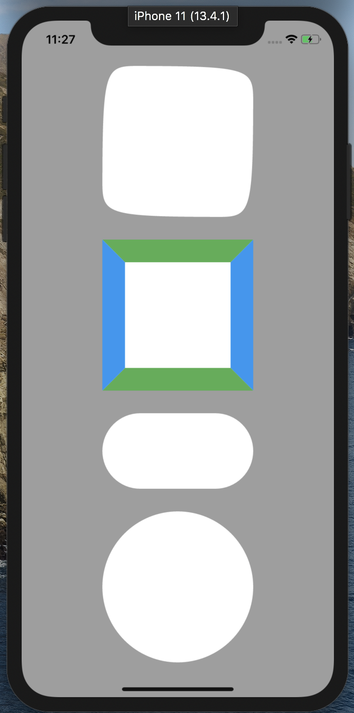
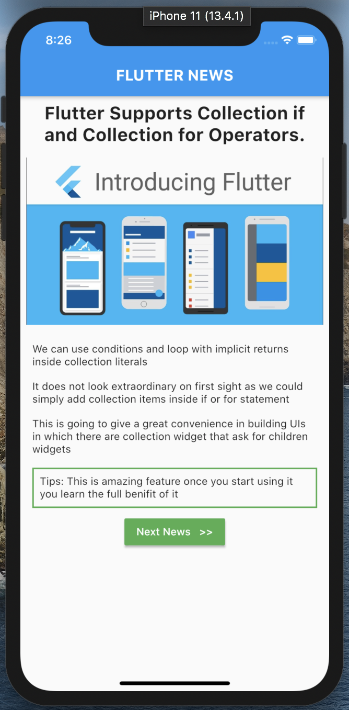
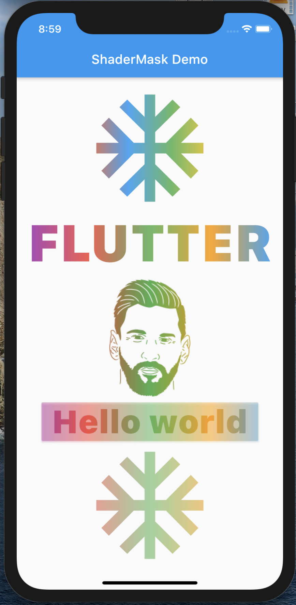
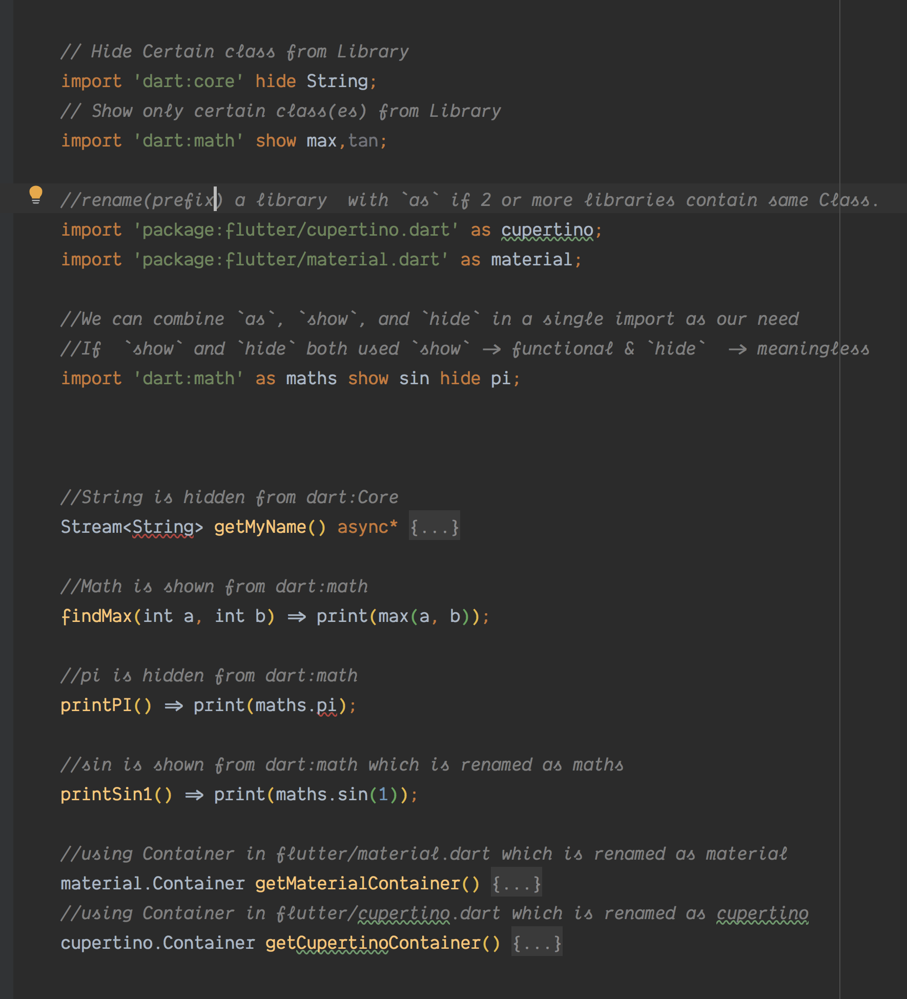
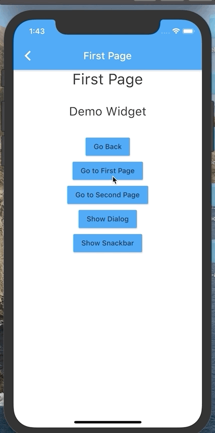
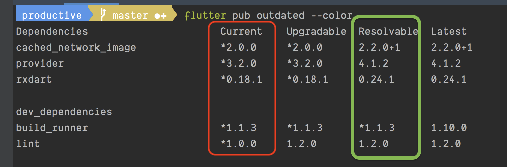
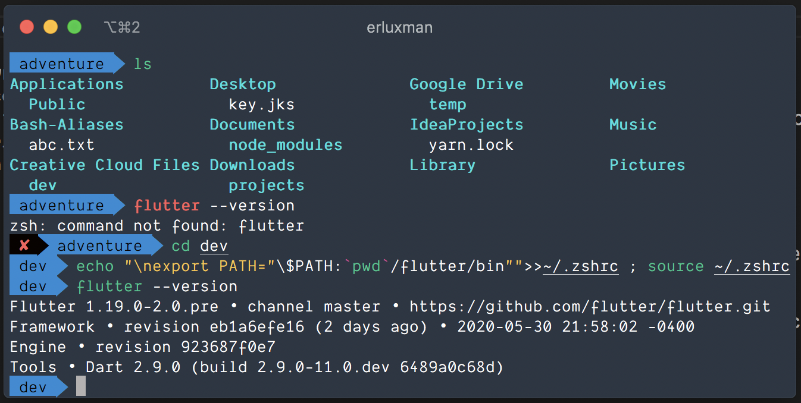
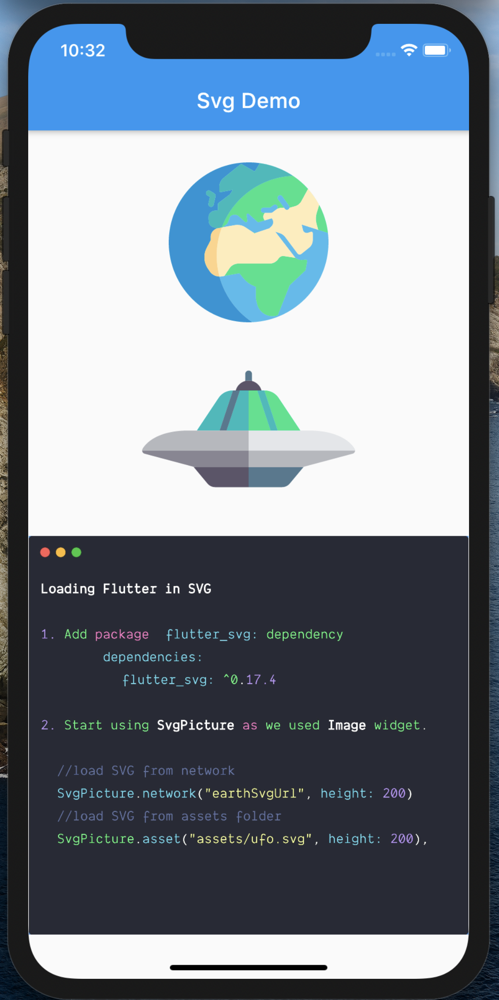

# Tips 41 - 60

## Tip 41 : Path Provider( `path_provider package`) (common file locations in iOS and Android)

Sometimes we want to get the location of Various common directories like:

### Download, Cache, Documents, External Storage, External Cache etc

The package `path_provider` is build for exact same reason so that we do not have to deal with Platform specific issues by our own.

1. Add path_provider to pubspect.
   `path_provider: ^verison`
2. Use it

```dart
//Gives download directory
Directory tempDir = await getTemporaryDirectory();

//Gives documents directory
Directory docDir = await getApplicationDocumentsDirectory();

//Gives external Storages
List<Directory> externalStorages = await getExternalStorageDirectories();

//Gives download directory
Directory downloadDir = await getDownloadsDirectory();
```

[Download `path_provider`](https://pub.dev/packages/path_provider#-readme-tab-)

## Tip 42 : Flutter ShapeBorder

We can use ShapeBorder to give outline to widgets or Clip them on it's shape. There are my ShapeBorder like `Border, ContinuousRectangleBorder, StadiumBorder, CircleBorder, BeveledRectangleBorder` etc.

1. Use ShapeBorder to give a Widget outline.
```dart
Container(
    decoration: ShapeDecoration(
        color: Colors.white,
        shape: // Any shape border
    ),
)
```
2. Use ShapeBorder to clip a Widget.
```dart
ClipPath(
    clipper: ShapeBorderClipper(
        shape: // Any shape border
    ),
    child: // Any Child to be clipped
)
```
[try in codepen](https://codepen.io/erluxman/pen/vYNQLPx)




## Tip  43 : Collection if & for

Do you miss number ranges like these in dart?

```kotlin
for (i in 1..4) print(i) //Kotlin Range
for (i until 1..4) print(i) //Kotlin Range
````

No problem. Just define this Range Extension on numbers and you will be good to go.
```dart
extension Range on num {
    List<num> until(num endPoint) {
        var exclusive = to(endPoint);
        exclusive.removeLast();
        return exclusive;
    }

    List<num> to(num endPoint) {
        var numbers = <num>[];
        if (endPoint > this) {
            for (int i = this; i <= endPoint; i++) {
                numbers.add(i);
            }
        } else {
            for (int i = this; i >= endPoint; i--) {
                numbers.add(i);
            }
        }
        return numbers;
    }
}
```
Then Simply use them  like this:

```dart
void main() {
    // 2,3,4,5,6,7,8,9,10
    for (int i in 2.to(10)) { print(i); }

    // 2,3,4,5,6,7,8,9
    for (int i in 2.until(10)) { print(i); }

    // 2,1,0,-1,-2,-3,-4,-5,-6,-7
    for (int i in 2.to(-7)) { print(i); }

    // 2,1,0,-1,-2,-3,-4,-5,-6
    for (int i in 2.until(-7)) { print(i); }
}
```
[try in dartpad](https://dartpad.dartlang.org/b14078511495bc822dfbc6895c273e15)

If you want more advanced range and other cool extensions use [dartx](https://github.com/leisim/dartx)

## Tip  44 : Collection if & for

If you logically decide wheather to add a particular item into collection or not? It looks like no big deal when we dealing with adding normal objects to a collection as we could simply add collection items inside if or for statement.

But if we want to conditionally add widget or list of them inside another as one as it's children, it's a pain.

From dart 2.3 onwards, we can use `collection if` and `collection for` operators for adding items to a collection `conditionally` or `in bulk`.

### **Without collection if  or collection for**

```dart
ListView(
    children: [
        Title(news.headline),      
        (news.cover != null) ? FeatureImage(news.cover) : Container(),
        ...news.paragraphs.map((paragraph) => Paragraph(paragraph)).toList(),
        (news.author != null) ? Authored(news.author) : Container(),
        Row(
           mainAxisAlignment: MainAxisAlignment.center,
            children: [
                (selected > 0) ? nextButton() : Container(),
                (selected < (allNews.length - 1)) ? prevButton() : Container(),
            ],
        )
    ],
)
```
### **With collection if  or collection for**
```dart
ListView(
    children: [
        Title(news.headline),
        if (news.cover != null) FeatureImage(news.cover),
        for (var paragraph in news.paragraphs) Paragraph(paragraph),
        if (news.author != null) Authored(news.author),
        Row(
            mainAxisAlignment: MainAxisAlignment.center,
            children: [
                if (selected > 0) nextButton(),
                if (selected < (allNews.length - 1)) prevButton(),
            ],
        )
    ],
)
```
[try on codepen](https://codepen.io/erluxman/pen/yLYGbdy)



## Tip 45 : tear-off vs lambda vs function call

### When possible we should use tear-off instead of these

1. ___`A function call if caller and calling functions have same arguments.`___

```dart
// Use tear-off instead of Function if arguments of caller and calling method match

// ❌  Normal Method call ❌
void logSomething(String abc) => print(abc);
// ✅  Using tear-off ✅
void logSomething(String abc) => print;

// ❌  Normal Method call ❌
pritSum(int first, int second) {
    var sum = getSum(first, second);
    print(sum);
}
// ✅  Using tear-off ✅
printSum1(int first, int second) => print(getSum);

// ❌  We cannot call tear-off on tear-off ❌
printSum2(int first, int second) => getSum.print;

int getSum(int first, int second) => first + second;
```

2. ___`A lambda.`___

 ```dart
// Use 'tear-off' closure instead of lambda when possible

// ❌  Using Lambda ❌
var button = MaterialButton( onPressed: () { buttonPressed(); } );
// ✅  Using tear-off ✅
var button1 = MaterialButton( onPressed: buttonPressed );

void buttonPressed() => print("Button Pressed");

// ❌  Using Lambda ❌
printFirstNSquares1(int count) {
    1.to(count)
    .map((number) {return getSquare(number); })
    .foreach((square) { print(square); } );
}
// ✅  Using tear-off ✅
printFirstNSquares(int count) => 1.to(count).map(getSquare).forEach(print);

int getSquare(int number) => number * number;
```
## Tip 46 : ColorFilterd Widget

Want to apply filter to image or any widget? Use ColorFiltered widget like this.

```dart
ColorFiltered(
    colorFilter :ColorFilter.mode(Colors.pink,BlendMode.multiply),
    child: //Widget
)
```
    

Try different BlendMode and colors.

ColorFiltered works with any widgets as child not just Image.

[get the code](https://gist.github.com/erluxman/7b5c1dfec4461b147d9b00a86d080bb5)


## Tip 47 : ShaderMask Widget

If you want to apply gradient mask or Image mask to any widget in flutter ShaderMask is the tool to use.

Just give `blendMode` and `shaderCallback` to ShaderMask along with the Child that you want to mask.

Gradients can be easily converted to Shader with createShader() method.

    ShaderMask(
        blendMode: BlendMode.srcIn,
        shaderCallback: (Rect bound) {
            return LinearGradient(colors: <Color>[
                Colors.deepOrange,
                Colors.blue,
                Colors.green,
                Colors.amber,
            ]).createShader(bound);
        },
        child: Icon(
            Icons.ac_unit,
            size: 200,
            ),
        )
[get the code](https://gist.github.com/erluxman/b6f1166ac19b7b2654ee2102c58a8837)



## Tip 48 : `synchronized` in dart

In languages like Java there is a `synchronized` keyboard that acts as lock for preventing concurrent access like while handling transactions.

In dart we have a package called `synchronized`. Add `synchronized: ^latest_version` to `pubspec.yaml` then start using it by:

Simply wrapping the transaction / block to be synchronized inside `synchronized()` and that block won't be called again until the previous call is finished.

```dart
import 'package:synchronized/extension.dart';
main() async {
    var demo = Demo();
    await demo.runSynchronized();   // prints 12341234
    await demo.runNotSynchronized();// prints 11223344
}

class Demo {
    Future runNotSynchronized() async {
        stdout.writeln('not synchronized');
        write1234();
        write1234();
        await Future.delayed(const Duration(milliseconds: 300));                            
        stdout.writeln();
    }

    Future runSynchronized() async {
        stdout.writeln('synchronized');
        synchronized(() async { await write1234(); });
        synchronized(write1234);
        await Future.delayed(const Duration(milliseconds: 300));
        stdout.writeln();
    }
        
    Future write1234() async {
        for (var value in [1, 2, 3, 4]) {
            await Future.delayed(const Duration(milliseconds: 30));
            stdout.write(value);  
        }
    }
}
```
[get synchronous package](https://pub.dev/packages/synchronized#-installing-tab-)

[get code Gist](https://gist.github.com/erluxman/ff1e8e9581285cf327e95b281585fbd7)

## Tip  49 : Circular Image/Widget

In almost every app we need circular image (with a border & shadow).

Just wrap the Image like this :  

___`Widget/Image()`___ -Inside-> ___`ClipRRect()`___ -Inside-> ___`Container()`___(with circular BoxDecoration and boxShadow)

```dart
Container(
    decoration: BoxDecoration(
        borderRadius: BorderRadius.circular(200),
        border: Border.all(color: Colors.indigoAccent, width: 8),
        boxShadow: [
            BoxShadow(
                color: Color(0x332222CC),
                blurRadius: 6,
                spreadRadius: 6,
                offset: Offset.fromDirection(0, 0)),
            ]
        ),
    child: ClipRRect(
        borderRadius: BorderRadius.circular(400),
        child: Image.network("imageUrl",height: 200,width: 200,),
    ),
),
```
[try in codepen](https://codepen.io/erluxman/pen/abvxvOz)


## Tip  50 : Use `a is! A` instead of `!(a is A)`

Flutter has special keyword to check if an instance ___`is not a type`___.

```dart
var name = "Hello World";

// ✅  Right way ✅
assert(name is String);

//❌  Wrong way ❌
assert(!(name is int));

// ✅  Right way ✅
assert( name is! int); 
```
## Tip 51 : Named constructor

Have you been using static methods to initialze Objects with name?

Use named constructor :

```dart
class Color {
    Color({this.r, this.b, this.g});
    int r = 0, g = 0, b = 0;

    // ❌ static method
    static Color red() => Color(r: 255,g: 0,b:255);                                      
    // ✅ named constructor
    Color.red() {
        r = 255;
    }

    // ❌ static method
    static Color cyan() => Color(r:0, b: 128, g: 128);
    // ✅ named constructor
    Color.cyan(): g = 128, b = 128;
    // ✅ named constructor
    Color.cyan() {
        g = 128;
        b = 128;
    }
}
```
## Tip 52 : Imports on Steroids 💉💉

___`as :`___ If we import two or more libraries that have conflicting identifiers, we can use them with `prefix.` given after `as` keyword.

`import 'package:library.dart' as lib;`

___`show :`___ Show only certain class and hide everything else from it.

`import 'dart:math' show max,tan;`

___`hide :`___ Hide only certain class & show everything else from it.

`import 'dart:core' hide String;`



## Tip 53 : final vs const

`final and const` in dart are confusing to the level we think both of them are same. Let's see their diffrences

| ___`final`___ (global / static / member variables)                                                                                                                                                                 | ___`const`___ (static / global variables)                                                                                                 |
| ------------------------------------------------------------------------------------------------------------------------------------------------------------------------------------------------------------------ | ----------------------------------------------------------------------------------------------------------------------------------------- |
| Has single value of a `member or static or global variable` from start to end.                                                                                                                                     | Has single value of a `static or global variable` from start to end.                                                                      |
| Different objects of same type can have different final values in same member varaible.                                                                                                                            | Different objects of same type cannot have different const values in same varaible. (i.e. `const members should be static`)               |
| Should be initialzed `before constructor is called`.                                                                                                                                                               | Should be `strictly initialized during declaration`.                                                                                      |
| Only the `final` declared `member/staic/global variable` objects are immutable, their content variables may not. i.e. variables inside final objects can be udpated / reassigned if they are not final themselves. | All `const` declared `Golbal/static` variable objects including all their internal content varibales are immutable and cannot be changed. |
| Can be `intialized` with `immutable/ mutable / calculated values` determined at  `compile time or runtime`.                                                                                                        | Can be `initialized`  with `only immutable values` with all their immutable internal varaibles, determined at `compile time`.             |

We can take example of various computers and how they can be compared with dart modifiers.


## Tip 54 : FutureBuilder

If you want to display data from API backend or any async source, use FutureBuilder.

FutureBuilder will automatically give you Widget with default  value until the data arrives from API/ async Source.

As soon as the real data arrives, it will rebuild the Widget with actual data.

Just provide the async function / source that will return the values asynchronously along with initial(default) data.

It works very similar to `StreamBuilder`

```dart
//Future Builder
FutureBuilder<List<Player>>(
    initialData: [],
    future: FakePlayersAPI().getPlayers(),
    builder: (context, snapshot) {
        if (snapshot.data.isEmpty) return CircularProgressIndicator()
        else return PlayersListWidget(snapshot.data)
    }
)

//Fake Backed API.
class FakePlayersAPI {
    Future<List<Player>> getPlayers() async {
        await Future.delayed(Duration(seconds: 1));
        return _players;
    }

    Future<String> getPlayerStory() async {
        await Future.delayed(Duration(seconds: 1));
        return playerStoryText;
    }
}
```
[try on codepen](https://codepen.io/erluxman/pen/PoPrgbR)


## Tip 55 : `Get` the easy Navigation library

Bored of writing `PageRoute`,`context` and `builder` without actual use of them just to navigate to different Widget? Use `get: ^version` library.

Also this gives us superpower to `navigate/show dialog/ BottomSheet/ Snackbar` without`BuildContext`, there might be cool patterns to be developed with this freedom.

1. Just Replace your MaterialApp with `GetMaterialApp`.
2. Start navigating like this :

```dart
//Go to next screen
Get.to(NextScreen());
        
//Show dialog
Get.dialog(MyDialogWidget());
        
//Show bottom sheet
Get.bottomSheet(MyButtomSheetWidget)

//Show snackbar 
Get.snackbar(title, subTitle);
```
[visit library](https://pub.dev/packages/get)

[demo](https://gist.github.com/erluxman/2d1723e3395325fb5511809f6f95e21b)



## Tip 56 : `pub outdated`

Maintaining latest versions of pub dependencies is pain. Even worse, every latest versions are compatible.

From dart 2.8 onwards, the command `pub outdated` gives you the overview of your dependencies and possible upgrades in ___**`Resolvable column`**___.



🚨🚨Tip: use `flutter pub outdated` if `pub outdated` can't find Flutter SDK.

## Tip 57 : typedef

`typedef` is used when you want to give an alias to a **`Function signature`**. As it can be laborous and error prone to type the Function Signature in every field or return type. As a bonus, we do not lose Function's type info.

__`Steps to use typedef:`__

Step 1 : Define a `typedef`  with Function Signature __`outside a class`__.
```dart
typedef UserSelector = User Function(String, String);
```
Step 2 : Replace the Function Signature with typedef to declare members or return type.
```dart
class A{
    //Use this ✅
    UserSelector userSelector;

    // Not this ❌
    User Function(String, String) userSelector;

    A ({this.userSelector});
}
```
Step: Simply pass function/ lambda like you did before.
```dart
//Pass lambda 
var a = A(userSelector: (id, authKey) {
    return User(id, "User name");
});

//Pass Method
var a = A(userSelector: getUser)

User getUser(String id, String key) {
    return User(id, "User name");
}
```
## Tip 58 : Easy Flutter installation

Still confused installing flutter in mac/linux easily?

1. Download Flutter zip.
2. Decompress it in desired directory.
3. `cd` to that desired directory from terminal.
      [🚨⚠️ flutter should be inside desired directory]
4. Run the following command  
```bash
# If you are using zsh:
echo "\nexport PATH="\$PATH:`pwd`/flutter/bin"">>~/.zshrc ; source ~/.zshrc

# If you are using bash:
echo "\nexport PATH="\$PATH:`pwd`/flutter/bin"">>~/.bashrc ; source ~/.bashrc
```


## Tip 59 : #BlackLifeMatter

Black lives matter ✊🏿& Racial Equality should be the norm.

This is a tip not just for Flutter developers but to all of us human.

This is my tip number #59.


## Tip 60 : Using SVG

Even though flutter doesn't support any vector graphics out of the box, the package `flutter_svg` can render `svg` into Flutter app.

1. Add dependency :
        `flutter_svg: ^version`

2. Start using it like Flutter `Image` Widget.
```dart
//load SVG from network
SvgPicture.network("https://image.flaticon.com/icons/svg/124/124555.svg", height: 200)
        
//load SVG from assets folder
SvgPicture.asset("assets/ufo.svg", height: 200)
```
[visit flutter_svg](https://pub.dev/packages/flutter_svg#-readme-tab-)



[__`Tips 1-20`__](README.md)

[__`<< Previous`__](page2.md)
[___`Tips 41-60`___](page3.md)
[__`Next >>`__](page4.md)

[__`Tips 81-100`__](page5.md)
