# Tips 81 - 100

## Tip 81 : Use [quicktype.io](https://app.quicktype.io/) to generate `serializer/deserializer` for dart

Convert a `JSON` into `Dart class` with `fromJSON()` and `toJSON()` methods easily with  [quicktype.io](http://quicktype.io) 

Just **paste your JSON** and select `dart` from languages (right-top), you will get the `dart class`.

 try quicktype

[app.quicktype.io](app.quicktype.io)

Alternative:

Or [json to dart](https://javiercbk.github.io/json_to_dart/)


## Tip 82 : Loading PDF

You can display PDF easily with `pdf_flutter`

1. Add `pdf_flutter` on pubspec.yml

        dependencies:
          pdf_flutter: ^version

2. On `iOS` enable **PDF preview** like by adding this on ios/Runner/info.plist:

        <key>io.flutter.embedded_views_preview</key>
        <true/>
3. Start Using

        //Load PDF from Network
        PDF.network(
            'https://raw.githubusercontent.com/FlutterInThai/Dart-for-Flutter-Sheet-cheet/master/Dart-for-Flutter-Cheat-Sheet.pdf',
            height: 500,
            width: 300,)
        
        //Load PDF from Assets
        PDF.assets("assets/pdf/demo.pdf",height:400,width:300)
        
        //Load PDF from file
        File fileName;
        PDF.file(fileName,height:400,width:300)

Visit [pdf_flutter](https://github.com/erluxman/pdf_flutter)

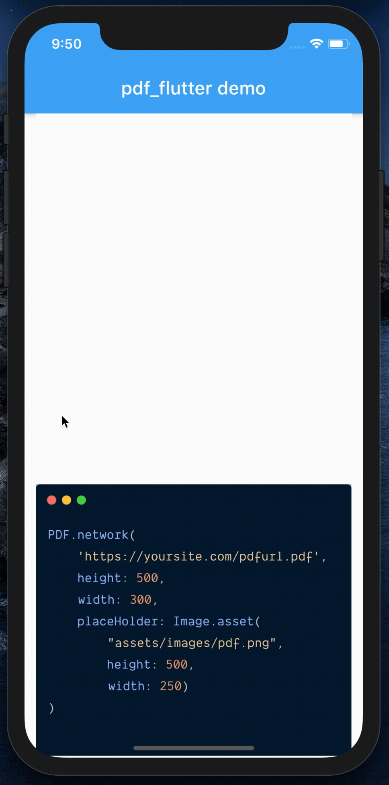

## Tip 83 : `flutter clean`

An obvious but underappreciated tip:

More than half of the unexpected/strange build errors can be solved by `flutter clean`

The first step towards fixing any build errors in Flutter should be:

    flutter clean 

__`🤡Remember this command, it will save you hours of frustration`__

## Tip  84 : Use `Alice` plugin to inspect network requests like chuck

Alice records Http request,payload & response which can be viewed in simple UI (notification or widget). Alice can work with http:http, dart:io/HttpClient, Chopper & Dio.

### Steps

1. Add dependency.
2. Create Alice instance (global is OK)

        Alice _alice = Alice(showNotification: true, showInspectorOnShake: true);

3. Pass  `_alice.getNavigatorKey()` as NavigatorKey of Material/Cupertino App.

        MaterialApp(
            navigatorKey: _alice.getNavigatorKey(),
            child:....
        )

4. Start logging (using http:http for sample)

        import 'package:http/http.dart' as http;

        http
            .post('https://jsonplaceholder.typicode.com/posts', body: body)
            .interceptWithAlice(_alice, body: body);

        http
            .get('https://jsonplaceholder.typicode.com/posts')
            .interceptWithAlice(_alice);

        http
            .put('https://jsonplaceholder.typicode.com/posts/1', body: body)
            .then((response) {
          _alice.onHttpResponse(response, body: body);
        });

5. See the HTTP call details  
  Simply call `_alice.showInspector();`  

    **or**

    `Just shake the phone`

    **to**

    open the **Http call details** screen.

[get alice](https://pub.dev/packages/alice)


## Tip 85 : Neumorphic Design with `clay_containers`

`clay_containers` makes it easy to build Neumorphic UI.

1. Add dependency

    dependencies:
      clay_containers: ^version

2. Start using

        ClayContainer(
                color: baseColor,
                height: 200,
                width: 200,
                child:Center(child:newChild) //Put child inside Center to align it centrally.
                depth:45, // negative elevation(both +ve & -ve)
                curveType: CurveType.convex, //Curve of surface (concave, convex, plane)
                borderRadius: 200,
              )

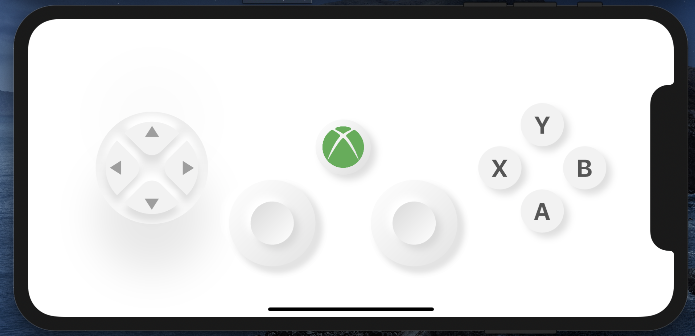

[see xbox controller demo](https://github.com/erluxman/clay_container_demo)

[visit clay_containers](https://pub.dev/packages/clay_containers#-readme-tab-)

## Tip  86 : `provider`

Passing an object/bloc from a parent widget to it's children across the widget tree by passing it through every Widget constructor between parent and the reciever child is hard.

With `provider` you can easily pass object/bloc from parent to any widget below it in widget tree.

1. Add dependency
  
```dart
provider: ^4.1.3
```

2. Pass object/model/bloc from Parent Widget by wrapping any widget with Provider.

```dart
  @override
  Widget build(BuildContext context) {
    return Provider(
      create:(_)=> User("erluxman"),
      child: ScreenA(
        child:ScreenB(
          child:ScreenC(),
        ),
      ),
    );
  }

  class User{
    String name;
    User(this.name);
  }
```

3. Recieve object/model/bloc/ by calling `Provider.of<ObjectType>(context)`

```dart
class ScreenC extends StatelessWidget {
  @override
  Widget build(BuildContext context) {
    User user = Provider.of<User>(context);
    print(user.name); //erluxman
    return Container(
      child: Center(
        child: Text(user.name), //erluxman
      ),
    );
  }
}
```

[visit provider](https://pub.dev/packages/provider)

## Tip 87 : Flutter Sinppets

Using Flutter snippets helps gain speed and become productive by eliminating the time typing the boilerplate code by autocompleting various snippets.

[for android studio](https://plugins.jetbrains.com/plugin/12348-flutter-snippets)

[for vscode](https://marketplace.visualstudio.com/items?itemName=Nash.awesome-flutter-snippets)


## Tip 88 : Create Emoji FloatingActionButton

When we get too used to using Icon in FloatingActionButton, we tend to forget that we can use various types of widget as FloatingActionButton's child.

We can use emoji Text as Child to FloatingActionButton to get wonderful colorful Fabs without any image.

```dart
FloatingActionButton(
  backgroundColor: Colors.white,
  child: Text(
    "🚀",
    textAlign: TextAlign.center,
    style: TextStyle(fontSize: 30),),
)
```

[try in codepen](https://codepen.io/erluxman/pen/vYLpgBo)

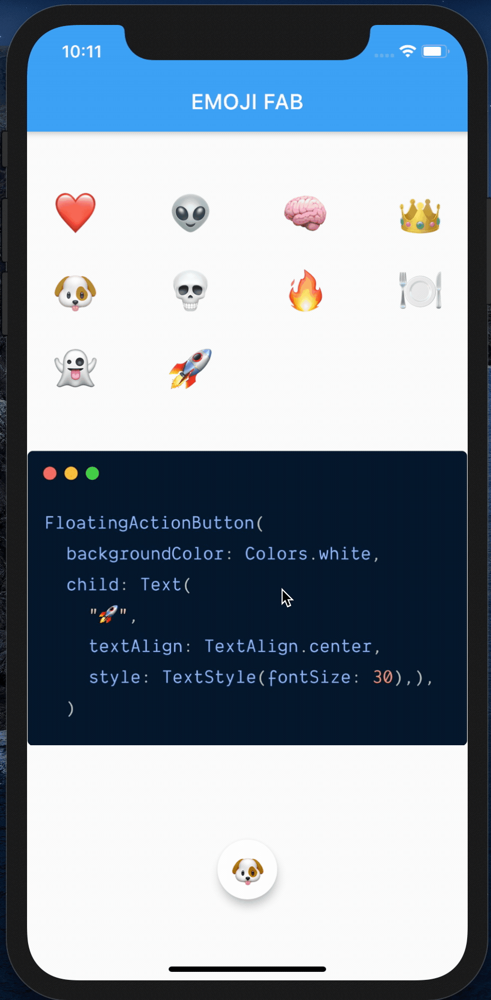

## Tip 89 : Run any task in a periodic interval  with `Timer.periodic()`

You can run any task repeatedly in a certain time period like this:

```dart
Timer.periodic(const Duration(seconds: 1), (Timer time) {
    setState(() {
        // Your code that runs periodically
        secondsPast += 1;
    });
});
```

[try on codepen](https://codepen.io/erluxman/pen/pogpqxX)

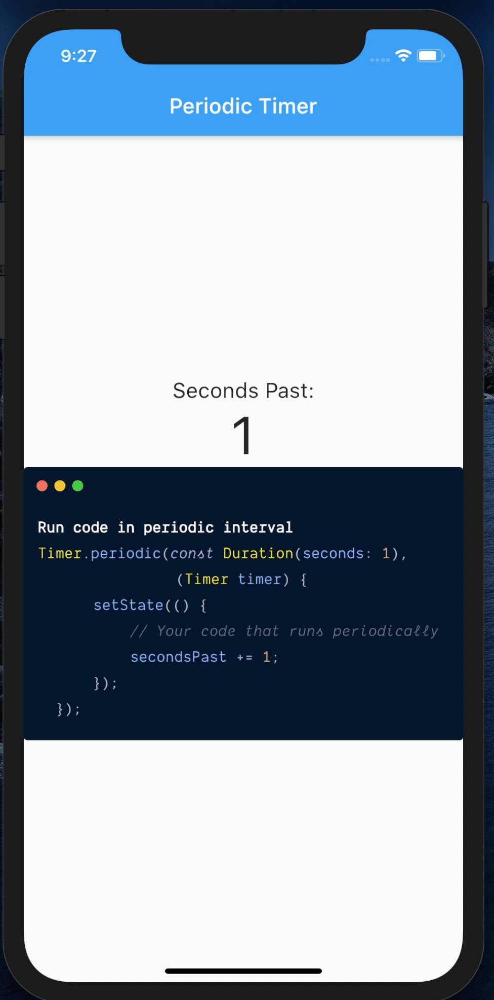

## Tip 90 : Launcher Icon with ease

 **Don't want to create launcher Icons for platform and put them in place manually?**

 use `flutter_launcher_icons`

 1. Add dev dependency (__`remember dev_dependencies`__).

```yml
dev_dependencies:
  flutter_launcher_icons: ^0.7.5
```

 2. Configure flutter_icons (**`no spaces before flutter_icons:`**)

```yml
flutter_icons:
  android: "launcher_icon"
  ios: true
  image_path: "assets/images/ic_launcher.png" #use your image path
```

3. Generate Icons

```shell
flutter pub run flutter_launcher_icons:main
```

4. Run app

| Android icon |iOS icon|
|--|--|
|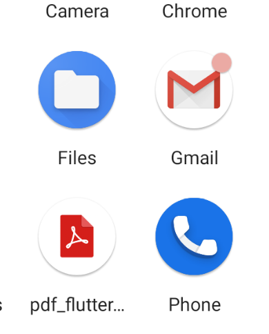| 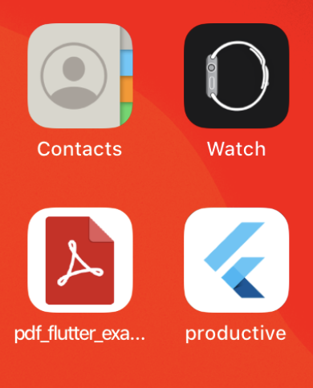 |

[visit flutter_launcher_icons](https://pub.dev/packages/flutter_launcher_icons)

## Tip 91 : `dough` package

Want to make Flutter widgets smooshy like Jelly or Dough? Use the package `dough`

1. Add `dough` to dependency
```yml
dependencies:
  dough: ^version
```

2. Wrap any widget with `PressableDough()`. 

```dart
PressableDough(
  child: FloatingActionButton(
    onPressed: () {},
    child: Text("🧠",style: TextStyle(fontSize: 40)),
  ),
)
```

3. **Sorry to disappoint but you are already done 😜**

[sample gist](https://gist.github.com/erluxman/1e102548403db046872d7db530e73594)

[visit dough](https://pub.dev/packages/dough#-installing-tab-)

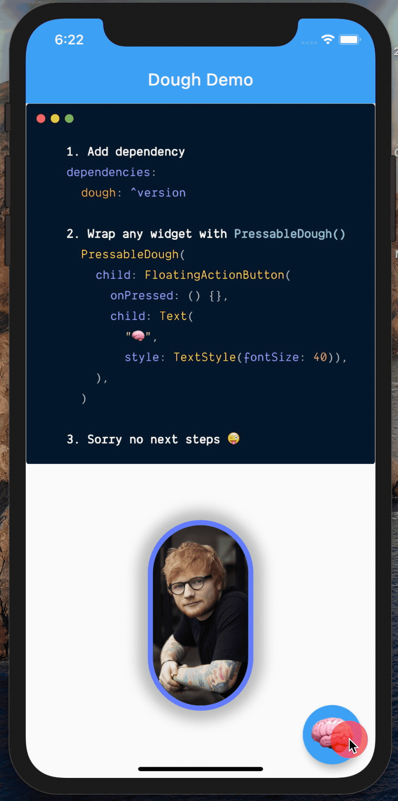

## Tip 92 : Autocomplete TextField with `flutter_typeahead`

Autocomplete TextField can be implemented with `flutter_typeahead` Package.

1. Add Dependency

```yml
dependencies:
  flutter_typeahead: ^version
```

2. Use `TypeAheadFormField` / `TypeAheadField`

```dart
var platforms = ["Flutter", "Android", "iOS", "Mac", "React", "Cordova"];
final TextEditingController input = TextEditingController();

TypeAheadFormField(
  textFieldConfiguration: TextFieldConfiguration(
    decoration: InputDecoration(labelText: 'City'),
    controller: this.input),

  //Search and return found values
  suggestionsCallback: (pattern) => platforms.where(
    (item) => item.toLowerCase().contains(pattern.toLowerCase()),
  ),
  itemBuilder: (_, item) => ListTile(title: Text(item)),
  onSuggestionSelected: (query) => this.input.text = query,
),
```

[visit flutter_typeahead](https://pub.dev/packages/flutter_typeahead)

[visit demo](https://gist.github.com/erluxman/523818577fa54cb6d0f5e0e8cc1d6a9a)

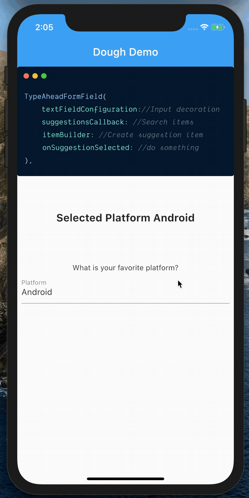

## Tip 93 : Read Network State with `connectivity` package

`connectivity` package makes it easy to read network state of device.

1. Add dependency

```yml
dependencies:
  connectivity: ^version
```

2. Read network states

```dart
class State ...{
  @override
  initState() {
    super.initState();
    subscription = Connectivity()
      .onConnectivityChanged
      .listen((ConnectivityResult result) {
          if (result == ConnectivityResult.mobile) //mobile connected.
          else if (result == ConnectivityResult.wifi) //Wifi Connected.  
          else if(result == ConnectivityResult.none) //No network
    });
  }

  @override
  dispose() {
    subscription.cancel();
    super.dispose();
  }
}
```

[visit connectivity package](https://pub.dev/packages/connectivity)

[visit sample gist](https://gist.github.com/erluxman/7e47f12378e79e0168cca7b6eea1c416)

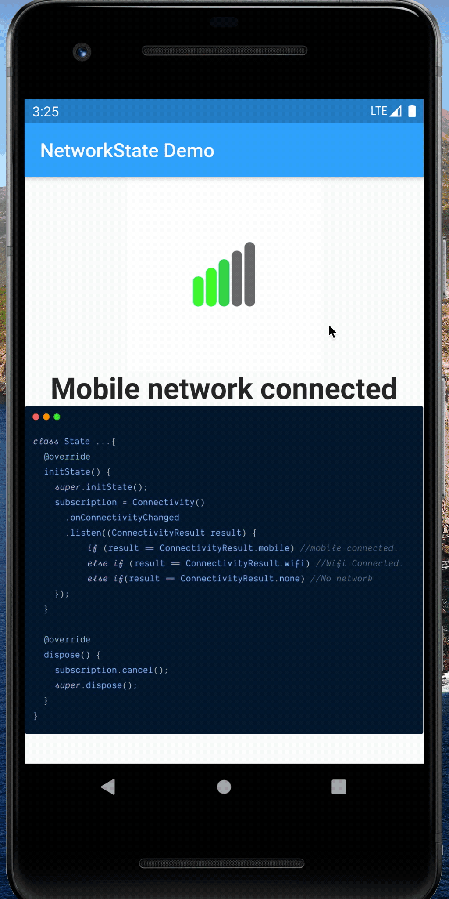

## 94 Tip  ⚡️ `superCharged`⚡️

`supercharged` brings awesome utility features from other languages to dart 🎯. making developers life easier.
### 1. Add Dependency

```yml
dependencies:
  supercharged: ^1.6.0
```  

### 2. Have fun 🎉

```dart
"#ff00ff".toColor();
"red".toColor();
"flutter is cool".allBefore(" is"); // "flutter"
12.between(0, 30); // true
[1, 2, 3].elementAtOrNull(4); // Don't throw, return null
[1, 2, 3].elementAtOrElse(4, () => 0); //Don't throw, return default value
//Create Pages from list
["a", "b", "c"].chunked(2, fill: () => ""); // [ ["a", "b"], ["c", ""] ]

var duration = 5.minutes + 30.seconds;
duration += 0.5.hours

100.0.tweenTo(200.0); // Tween(begin: 100.0, end: 200.0)
Colors.red.tweenTo(Colors.blue); // ColorTween(...)

//Easy for loop
["dog", "cat"].forEachIndexed((index, value) {
    print("$i : $value") // 1 : dog, 2 : cat
});
```

[visit supercharged](https://pub.dev/packages/supercharged)

## Tip 95 : DefaultTextStyle Widget

We can apply TextStyle to all the widgets in the hirarchy by wrapping it with DefaultTextStyle.

```dart
 DefaultTextStyle(
    child: Column(
      children: <Widget>[
        Text(
          "DefaultTextStyle With Green text color",
          textAlign: TextAlign.center,
          style: TextStyle(fontSize: 20, color: Colors.black),
        ),
        Text("Title"), //Green color, size 30
        Text("SubTitle", style: TextStyle(fontSize: 25)), //Green color, size 25
        Text("Heading", style: TextStyle(fontSize: 20)), //Green color, size 20
      ],
    ),
    style: TextStyle(fontSize: 30, color: Colors.green),
  );
```

[visit sample](https://codepen.io/erluxman/pen/wvMXJKK)

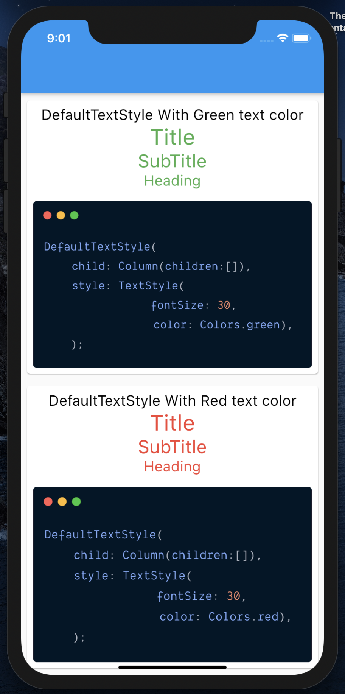

## Tip 96 : `flutter_cache_manager`

You can use `flutter_cache_manager` to Download **`and / or`** Cache files.

```dart
//Get file from Cache and download if not cached already.
File file = await DefaultCacheManager().getSingleFile(url);

//Download File without caching
File file = await DefaultCacheManager().downloadFile(url);
```

[visit on pub.dev](https://pub.dev/packages/flutter_cache_manager#-readme-tab-)

## Tip 97 : Make link on Text clickable using `flutter_linkify`

`flutter_linkify` is a Text Widget that automatically finds the URL link in the string and makes it clickable.

1. Add dependency

```yml
dependencies:
  flutter_linkify: ^version
```

2. Enjoy

```dart
  Linkify(
    text: "My  twitter https://twitter.com/erluxman",
    onOpen: (LinkableElement url) {
      Scaffold.of(context).showSnackBar(
        SnackBar(content: Text("${url.text} clicked")),
      );
    },
  )
```

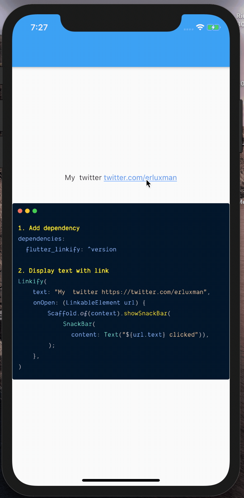
[visit pacakge](https://pub.dev/packages/flutter_linkify#-installing-tab-)

### Tip 98 : Package `flutter_spinkit`

We need to show **`loading/progress`** in almost every apps, but `CircularProgressBar` everywhere is boring.

`flutter_spinkit` provides many awesome Progress indictors that we can use.

1. Add dependency

```yml
flutter_spinkit: ^4.1.2+1
```

1. Start Using
   - #### 🔥Type `SpinKit` and press  `Ctrl+SPACE` to see all possible indicators.
   - Give `color (@required)`, `size(optional)` and `duration(optional)` to SpinKit* widgets.

```yml
SpinKitCircle(size: 90, color: Colors.cyan),
SpinKitChasingDots(size: 190, color: Colors.blue),
SpinKitCubeGrid(size: 90, color: Colors.blue),
SpinKitDualRing(size: 90, color: Colors.blue,),
SpinKitFadingCube(size: 90, color: Colors.red),
SpinKitFadingFour(size: 90, color: Colors.green)
```

[visit flutter_spinkit](https://pub.dev/packages/flutter_spinkit#-readme-tab-)


### Tip 99 : Show widgets as `Toast` with `oktoast`

We can show toast with `oktoast` package.

1. Add dependency:

```yml
dependencies:
  oktoast: ^2.3.2
```

2. Wrap **`(Material/Cupertino)App`** with `OKToast`

```dart
OKToast(
  child: MaterialApp( home: child)
)
```

3. Show `Text/Widget` as __`Toast`__ by calling `showToast()/showToastWidget()` from anywhere.

```dart
import 'package:oktoast/oktoast.dart';

showToast("Hello world");
showToast(Text("Hello world"));
```

[visit oktoast](https://pub.dev/packages/oktoast#-installing-tab-)

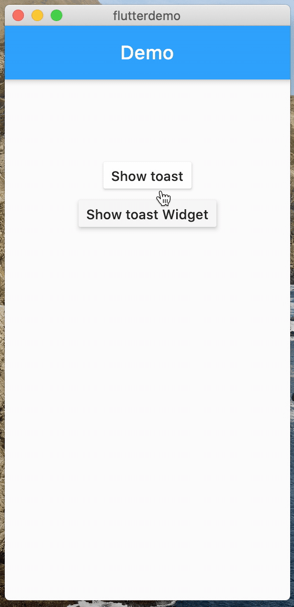

### Tip 100 : Easy Setting screens with `settings_ui`

Almost every app needs setting page, but doing it right across multiple platform is not a easy.

#### `settings_ui` helps create Consistant Setting Page with standard components

1. Add dependency

```yml
dependencies:
  settings_ui: ^version
```

2. Start Using

```dart

SettingsList( // Whole setting Page
  sections: [
    SettingsSection( // Set of similar settings items
      title: 'Common',
      tiles: [
        SettingsTile( // Single Setting item
          title: 'Language',
          subtitle: 'English',
          leading: Icon(Icons.language),
        ),
        SettingsTile( // Single Setting item
          title: 'Environment',
          subtitle: 'Production',
          leading: Icon(Icons.cloud_queue),
        ),
      ],
    ),
  ],
)
```

__`SettingList`__ -> Whole setting Page

__`SettingsSection`__ -> Set of similar settings Eg. Account, Security

__`SettingTile`__ -> Single Setting item Eg. Phone Number, Email

[visit settings_ui](https://pub.dev/packages/settings_ui#-example-tab-)

| Android Setting                   | iOS Setting               |
| --------------------------------- | ------------------------- |
| 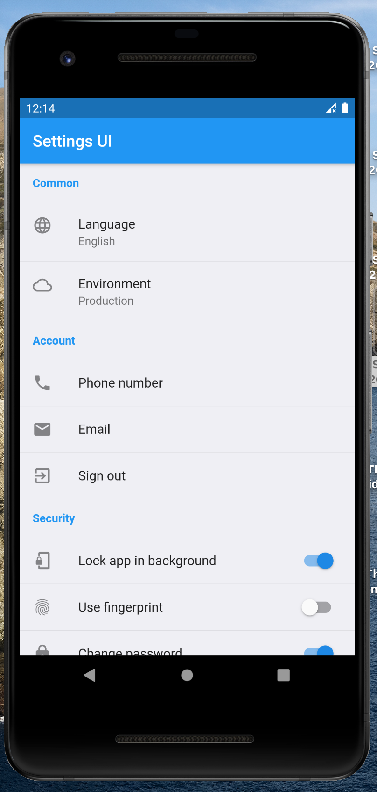 | 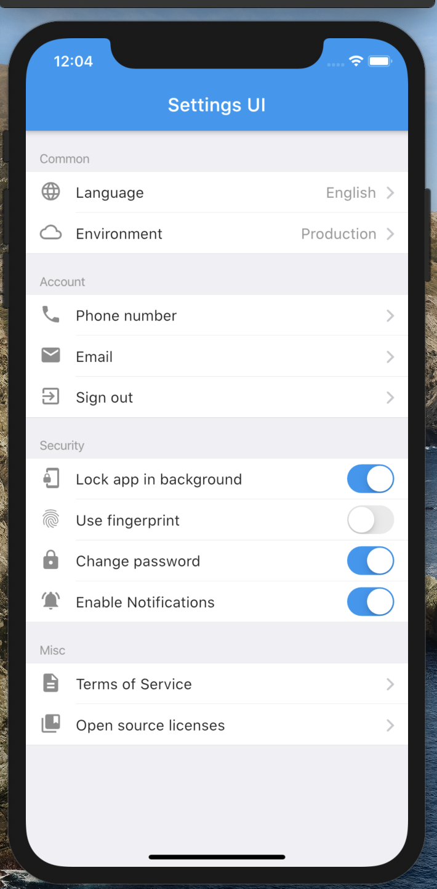 |

[__`Tips 1-20`__](README.md)
[__`Tips 21-40`__](page2.md)
[__`Tips 61-80`__](page3.md)

[__`<< Previous`__](page4.md)
[___`Tips 81-100`___](page5.md)
