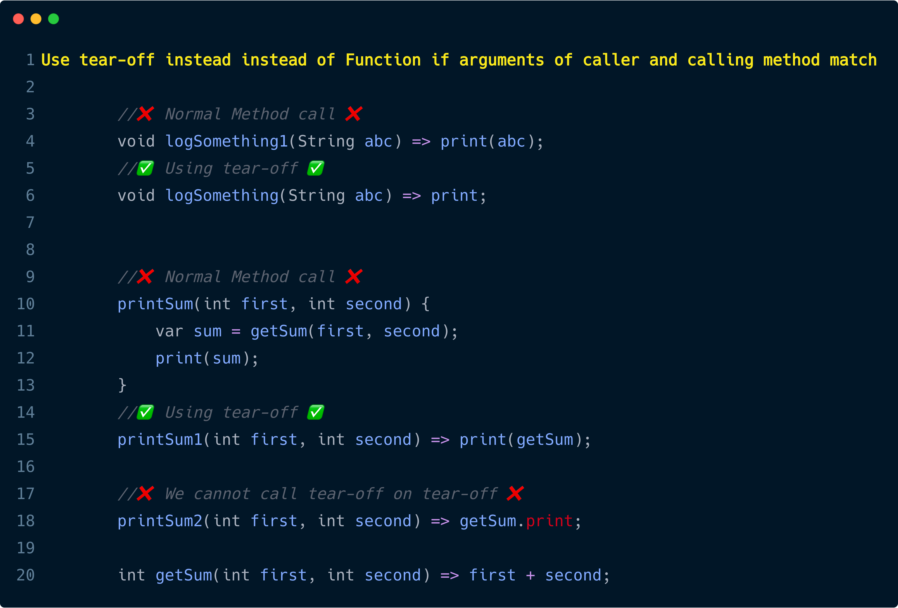
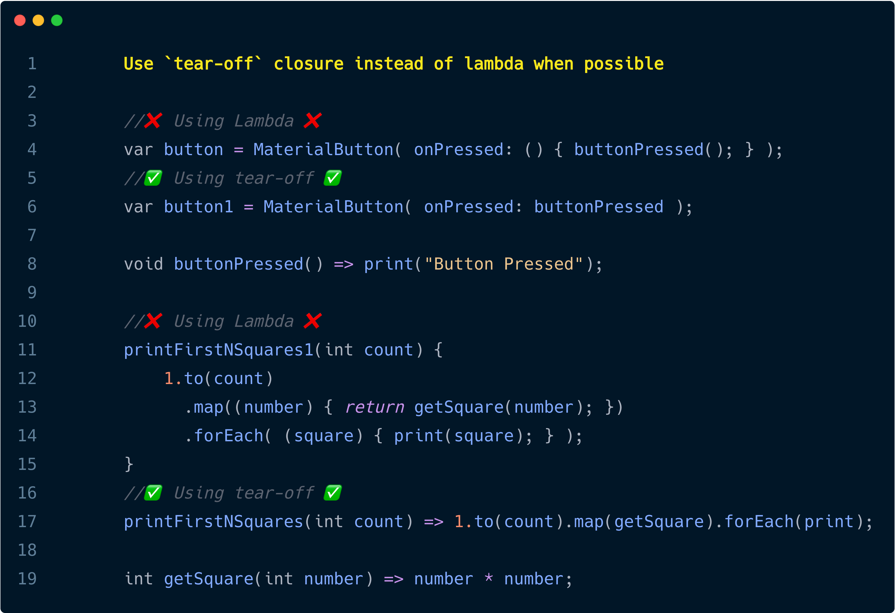

# Tips 43-49

## #Day 43 Collection if & for

Do you miss number ranges like these in dart?

    for (i in 1..4) print(i) //Kotlin Range
    for (i until 1..4) print(i) //Kotlin Range

No problem. Just define this Range Extension on numbers and you will be good to go.

    extension Range on num {
        List<num> until(num endPoint) {
            var exclusive = to(endPoint);
            exclusive.removeLast();
            return exclusive;
        }

        List<num> to(num endPoint) {
            var numbers = <num>[];
            if (endPoint > this) {
                for (int i = this; i <= endPoint; i++) {
                    numbers.add(i);
                }
            } else {
                for (int i = this; i >= endPoint; i--) {
                    numbers.add(i);
                }
            }
            return numbers;
        }
    }

Then Simply use them  like this:

    void main() {
        // 2,3,4,5,6,7,8,9,10
        for (int i in 2.to(10)) { print(i); }

        // 2,3,4,5,6,7,8,9
        for (int i in 2.until(10)) { print(i); }

        // 2,1,0,-1,-2,-3,-4,-5,-6,-7
        for (int i in 2.to(-7)) { print(i); }

        // 2,1,0,-1,-2,-3,-4,-5,-6
        for (int i in 2.until(-7)) { print(i); }
    }

[try in dartpad](https://dartpad.dartlang.org/b14078511495bc822dfbc6895c273e15)

If you want more advanced range and other cool extensions use [dartx](https://github.com/leisim/dartx)

## #Day 44 Collection if & for

If you logically decide wheather to add a particular item into collection or not? It looks like no big deal when we dealing with adding normal objects to a collection as we could simply add collection items inside if or for statement.

But if we want to conditionally add widget or list of them inside another as one as it's children, it's a pain.

From dart 2.3 onwards, we can use `collection if` and `collection for` operators for adding items to a collection `conditionally` or `in bulk`.

### **Without collection if  or collection for**

        ListView(
            children: [
                Title(news.headline),
                
                (news.cover != null) ? FeatureImage(news.cover) : Container(),
                
                ...news.paragraphs.map((paragraph) => Paragraph(paragraph)).toList(),
                
                (news.author != null) ? Authored(news.author) : Container(),
                
                Row(
                    mainAxisAlignment: MainAxisAlignment.center,
                    children: [
                    (selected > 0) ? nextButton() : Container(),
                    (selected < (allNews.length - 1)) ? prevButton() : Container(),
                    ],
                )
            ],
        )

### **With collection if  or collection for**

        ListView(
            children: [
                Title(news.headline),
                
                if (news.cover != null) FeatureImage(news.cover),
                
                for (var paragraph in news.paragraphs) Paragraph(paragraph),
                
                if (news.author != null) Authored(news.author),
                
                Row(
                    mainAxisAlignment: MainAxisAlignment.center,
                    children: [
                    if (selected > 0) nextButton(),
                    if (selected < (allNews.length - 1)) prevButton(),
                    ],
                )
            ],
        )

[try on codepen](https://codepen.io/erluxman/pen/yLYGbdy)

## #Day45 tear-off vs lambda vs function call

### When possible we should use tear-off instead of these

1. ___`A function call if caller and calling functions have same arguments.`___

    

2. ___`A lambda.`___

 

## #Day46 ColorFilterd Widget

Want to apply filter to image or any widget? Use ColorFiltered widget like this.

    ColorFiltered(
        colorFilter :ColorFilter.mode(Colors.pink,BlendMode.multiply),
        child: //Widget
    )

Try different BlendMode and colors.

ColorFiltered works with any widgets as child not just Image.

[get the code](https://gist.github.com/erluxman/7b5c1dfec4461b147d9b00a86d080bb5)

## #Day47 ShaderMask Widget

If you want to apply gradient mask or Image mask to any widget in flutter ShaderMask is the tool to use.

Just give `blendMode` and `shaderCallback` to ShaderMask along with the Child that you want to mask.

Gradients can be easily converted to Shader with createShader() method.

    ShaderMask(
        blendMode: BlendMode.srcIn,
        shaderCallback: (Rect bound) {
            return LinearGradient(colors: <Color>[
                Colors.deepOrange,
                Colors.blue,
                Colors.green,
                Colors.amber,
            ]).createShader(bound);
        },
        child: Icon(
            Icons.ac_unit,
            size: 200,
            ),
        )
[get the code](https://gist.github.com/erluxman/b6f1166ac19b7b2654ee2102c58a8837)

## #Day48 `synchronized` in dart

In languages like Java there is a `synchronized` keyboard that acts as lock for preventing concurrent access like while handling transactions.

In dart we have a package called `synchronized`. Add `synchronized: ^latest_version` to `pubspec.yaml` then start using it by:

Simply wrapping the transaction / block to be synchronized inside `synchronized()` and that block won't be called again until the previous call is finished.

    import 'package:synchronized/extension.dart';
    main() async {
        var demo = Demo();
        await demo.runSynchronized();   // prints 12341234
        await demo.runNotSynchronized();// prints 11223344
    }
    class Demo {
        Future runNotSynchronized() async {
            stdout.writeln('not synchronized');
            write1234();
            write1234();
            await Future.delayed(const Duration(milliseconds: 300));                            
            stdout.writeln();
        }

        Future runSynchronized() async {
            stdout.writeln('synchronized');
            synchronized(() async { await write1234(); });
            synchronized(write1234);
            await Future.delayed(const Duration(milliseconds: 300));
            stdout.writeln();
        }
        
        Future write1234() async {
            for (var value in [1, 2, 3, 4]) {
            await Future.delayed(const Duration(milliseconds: 30));
            stdout.write(value);  }}
    }

[get synchronous package](https://pub.dev/packages/synchronized#-installing-tab-)

[get code Gist](https://gist.github.com/erluxman/ff1e8e9581285cf327e95b281585fbd7)

## #Day 49 Circular Image/Widget

In almost every app we need circular image (with a border & shadow).

Just wrap the Image like this :  

___`Widget/Image()`___ -Inside-> ___`ClipRRect()`___ -Inside-> ___`Container()`___(with circular BoxDecoration and boxShadow)

    Container(
            decoration: BoxDecoration(
                borderRadius: BorderRadius.circular(200),
                border: Border.all(color: Colors.indigoAccent, width: 8),
                boxShadow: [
                    BoxShadow(
                        color: Color(0x332222CC),
                        blurRadius: 6,
                        spreadRadius: 6,
                        offset: Offset.fromDirection(0, 0)),
                ]
            ),
            child: ClipRRect(
                borderRadius: BorderRadius.circular(400),
                child: Image.network("imageUrl",height: 200,width: 200,),
            ),
        ),

[try in codepen](https://codepen.io/erluxman/pen/abvxvOz)

[___`Tips 1-7`___](README.md)
[__`Tips 08-14`__](week02.md)
[__`Tips 15-21`__](week03.md)
[__`Tips 22-28`__](week04.md)
[__`Tips 29-35`__](week05.md)
[__`Tips 36-42`__](week06.md)

[__`<< Previous`__](week06.md)
[___`Tips 43-49`___](week07.md)
[__`Next >>`__](week08.md)

[__`Tips 50-56`__](week08.md)
[__`Tips 57-63`__](week09.md)
[__`Tips 64-70`__](week10.md)